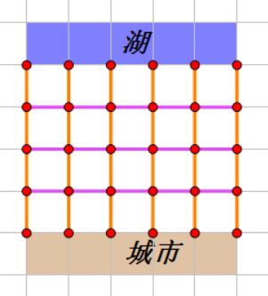
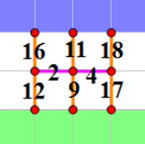

## 问题描述


MF城建立在一片高原上。由于城市唯一的水源是位于河谷地带的湖中，人们在坡地上修筑了一片网格状的抽水水管，以将湖水抽入城市。如下图所示：



这片管网由 n 行 m 列节点（红色，图中 n = 5，m = 6），横向管道（紫色）和纵向管道（橙色）构成。

行和列分别用 1 到 n 的整数和 1 到 m 的整数表示。第 1 行的任何一个节点均可以抽取湖水，湖水到达第 n 行的任何一个节点即算作引入了城市。

除第一行和最后一行外，横向相邻或纵向相邻的两个节点之间一定有一段管道，每一段管道都有各自的最大的抽水速率，并需要根据情况选择抽水还是放水。对于纵向的管道（橙色），允许从上方向下方抽水或从下方向上方放水；如果从图中的上方向下方抽水，那么单位时间内能通过的水量不能超过管道的最大速率；如果从下方向上方放水，因为下方海拔较高，因此可以允许有任意大的水量。对于横向的管道（紫色），允许从左向右或从右向左抽水，不允许放水，两种情况下单位时间流过的水量都不能超过管道的最大速率。

现在MF城市的水务负责人想知道，在已知每个管道单位时间容量的情况下，MF城每单位时间最多可以引入多少的湖水。

## 输入格式

由于输入规模较大，我们采用伪随机生成的方式生成数据。

每组数据仅一行包含 6 个非负整数 n, m, A, B, Q, X0。其中，n 和 m 如前文所述，表示管网的大小，保证 2 &le; n, m &le; 5000；保证 1 &le; A, B, Q, X0 &le; $10^9$。

A, B, Q, X0 是数据生成的参数，我们用如下的方式定义一个数列 { Xi }：

Xi+1 = ( AXi + B) mod Q, (i &ge; 0)

我们将数列的第 1 项到第 (n-1)m 项作为纵向管道的单位时间容量，其中 X(s-1)m+t 表示第 s 行第 t 列的节点到第 s+1 行第 t 列管道单位时间的容量；将数列的第 (n-1)m+1 项到第 (n-1)m+(n-2)(m-1) 项（即接下来的 (n-2)(m-1) 项）作为横向管道的单位时间容量，其中 X(n-1)m+(s-2)(m-1)+t 表示第 s 行第 t 列的节点到第 s 行第 t+1 列管道单位时间的容量。


## 输出格式


输出一行一个整数，表示MF城每单位时间可以引入的水量。

注意计算过程中有些参数可能超过32位整型表示的最大值，请注意使用64位整型存储相应数据。


## 样例输入
```
3 3 10 3 19 7
```
## 样例输出
```
38
```
## 样例说明1

使用参数得到数列 { Xi }={ 7, 16, 11, 18, 12, 9, 17, 2, 4, &hellip; }，按照输入格式可以得到每个管道的最大抽水量如下图所示：



在标准答案中，单位时间可以引水 38 单位。所有纵向管道均向下抽水即可，不需要横向管道抽水，也不需要向上放水。

## 样例输入
```
2 5 595829232 749238243 603779819 532737791
```
## 样例输出
```
1029036148
```
## 样例输入
```
5 2 634932890 335818535 550589587 977780683
```
## 样例输出
```
192923706
```
## 样例输入
```
5 5 695192542 779962396 647834146 157661239
```
## 样例输出
```
1449991168
```
## 评测用例规模与约定

| 测试点编号 | n     | m     |
|------------|-------|-------|
| 1          | =2    | =1000 |
| 2          | =1000 | =2    |
| 3          | =1000 | =2    |
| 4          | =5    | =5    |
| 5          | =10   | =10   |
| 6          | =100  | =100  |
| 7          | =500  | =500  |
| 8          | =1000 | =1000 |
| 9          | =2000 | =2000 |
| 10         | =5000 | =5000 |
