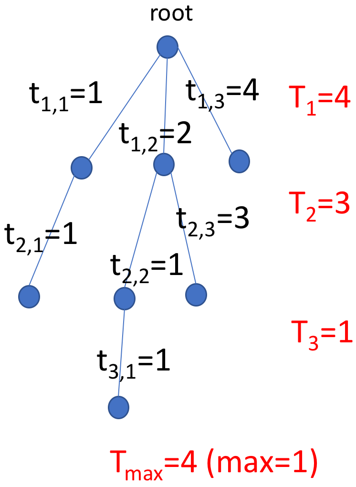
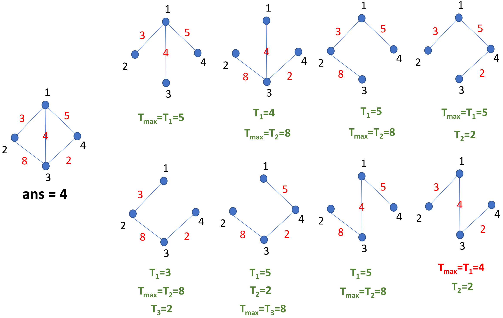

**时间限制：** 1.0 秒 


**空间限制：** 512 MB


## 知识背景

在一个集中式网络中，存在一个根节点，需要长时间接收其余所有节点传输给它的反馈数据。

## 题目描述
存在一个 $n$ 节点的网络图，编号从 $1$ 到 $n$。该网络的传输是全双工的，所以是无向图。如果两节点 $v_i, u_i$ 相连，表明 $v_i, u_i$ 之间可以互相收发数据，边权是传输数据所需时间 $t_i$。 **现在每个节点需要选择一条路径将数据发送到 $root$ 号节点。** 希望求出一个最优的树结构传输图，使得完成这个任务所需要的时间最少。$root$ 节点只能接收数据，其余任何一个节点可以将数据传输给另外的一个节点，但是不能将数据传输给多个节点。所有节点可以接收多个不同节点的数据。

  

一个树结构传输图的传输时间为 $T_{\max}$，其中 $T_{\max} = \max (T_h)$，$h$ 为接收点在树中的深度，$T_h=\max (t_{h, j})$，$t_{h, j}$ 表示 $j$ 条不同的边，这 $j$ 条边接收点的深度都为 $h$。

## 输入格式

从标准输入读入数据。

输入的第 $1$ 行包含一个正整数 $n$，保证 $n \leq 5 \times 10^{4}$。

输入的第 $2$ 行包含一个正整数 $m$，保证 $m \leq 10^{5}$。

输入的第 $3$ 行包含一个正整数 $root$，保证 $root \leq 5 \times 10^{4}$。

输入的第 $4$ 行至第 $3+m$ 行包含 $3$ 个正整数 $v_i, u_i, t_i$，保证 $v_i \leq 5 \times 10^{4}$，$u_i \leq 5 \times 10^{4}$，$t_i \leq 10^{6}$，$u_i \neq v_i$。

## 输出格式

输出到标准输出。

输出仅有一行，包含一个正整数 $ans$，表示最优的树结构流水线所耗时 $T_{\max}$。


## 样例1输入

```plain
4
5
1
1 2 3
1 3 4
1 4 5
2 3 8
3 4 2
```


## 样例1输出

```plain
4
```


## 样例1解释

  

下图是样例说明。

## 子任务
子任务 $1$（20分）：$n \leq 10^{2}$，$m \leq 4,500$。

子任务 $2$（30分）：$n \leq 10^{3}$，$m \leq 3 \times 10^{4}$。

子任务 $3$（20分）：$n \leq 10^{4}$，$m \leq 5 \times 10^{4}$。

子任务 $4$（30分）：$n \leq 5 \times 10^{5}$，$m \leq 10^{5}$。

所有子任务：$v_i, u_i, t_i$，保证 $v_i \leq 5 \times 10^{4}$，$u_i \leq 5 \times 10^{4}$，$t_i \leq 10^{6}$，$u_i \neq v_i$