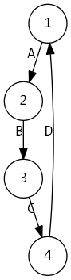
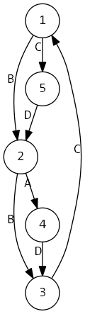

**时间限制：** 1.0 秒 


**空间限制：** 512 MB

[下载题目目录（样例文件）](examples/CSP201812-5.zip)


## 题目描述

Ajef 的实验室有一个伟大的管道网络，近期需要进行一次清洁。

这个管道网络可以用 $n$ 个节点 $m$ 条边的**有向**图表示。Ajef 需要用一个叫 Njoh'f 的机器人从 $1$ 号节点出发，清理完所有需要被清理的管道，最终回到 $1$ 号节点。

管道一共有以下四种类型：

* A 类：管道需要被清理，而且可以重复经过；
* B 类：管道需要被清理，但是不能重复经过；
* C 类：管道不需要被清理，而且可以重复经过；
* D 类：管道不需要被清理，但是不能重复经过。

一条需要清理的管道在 Njoh'f 经过它时，就会被它清理。因为管道是有向的，所以 Njoh'f 只能从一端走到另一端不能反过来走。对于不能重复经过的管道，Njoh'f 最多只能经过它一次。

因为管道网络的特殊性，如果把管道看成**无向**图，A 类和 B 类管道及其端点构成的子图是**连通**的，并且 $1$ 号节点一定在这个连通子图中。

首先 Ajef 想知道 Njoh'f 能不能在约束条件下清理完所有应该清理的管道（A 类和 B 类）。

Njoh'f 每经过一条管道一次，就会消耗 $E$ 个包子。如果网络能够被成功清理，Ajef 还想知道最少要消耗多少个包子。

## 输入格式

从标准输入读入数据。

输入的第一行包含三个非负整数 $T$、$S$、$E$，表示数据的组数、测试点的编号和经过一条管道一次消耗的包子数量。接下来有 $T$ 个部分，每个部分描述一组数据。对于评测数据，保证 $T=10$。保证 $E\in \{0,1\}$，这 $T$ 组数据的包子消耗速度相同。

每个部分第一行包含两个正整数 $n$、$m$，表示管道网络的节点数和边数。节点用 $1 \sim n$ 的整数编号。

接下来 $m$ 行，每行包含两个正整数 $u,v$ 和一个大写字母 $t$，相邻两个元素之间用一个空格隔开，表示一条从节点 $u$ 连向节点 $v$ 的管道，其类型为 $t$。保证 $1\leq u, v \leq n$，$t$ 一定是 `A`、`B`、`C`、`D` 之一。注意：**不保证不存在**重边和自环。

## 输出格式

输出到标准输出。

输出 $T$ 行，每行一个整数，表示每组数据的答案。

对于一组数据：如果 Njoh'f 无法清理所有的管道，输出 $-1$；如果可以清理所有管道，输出 Njoh'f 最少消耗的包子数量。


## 样例1输入

```plain
3 0 1
4 4
1 2 A
2 3 B
3 4 C
4 1 D
5 7
1 2 B
2 3 B
3 1 D
2 4 A
4 3 C
1 5 C
5 2 D
5 7
1 2 B
2 3 B
3 1 C
2 4 A
4 3 D
1 5 C
5 2 D

```


## 样例1输出

```plain
4
-1
8

```


## 样例1解释

这 $3$ 组数据如下图所示：

      

第 $1$ 组数据参考路线：$1  \Rightarrow 2  \Rightarrow 3  \Rightarrow 4  \Rightarrow 1$；

第 $2$ 组数据没有合法的路线；

第 $3$ 组数据参考路线：$1  \Rightarrow 2  \Rightarrow 3   \Rightarrow 1   \Rightarrow 5   \Rightarrow 2   \Rightarrow 4   \Rightarrow 3   \Rightarrow 1$。

## 子任务

各测试点数据规模如下：

 
	


<table class="table table-bordered"><thead><tr><th rowspan="1">测试点编号 $S=$</th><th rowspan="1">$n=$</th><th rowspan="1">$m=$</th><th rowspan="1">允许的边种类</th><th rowspan="1">其他限制</th></tr></thead><tbody><tr><td rowspan="1">1,2</td><td rowspan="1">$5$</td><td rowspan="1">$15$</td><td rowspan="4">ABCD</td><td rowspan="2">无</td></tr><tr><td rowspan="1">3,4</td><td rowspan="1">$10$</td><td rowspan="1">$30$</td></tr><tr><td rowspan="1">5,6,7,8</td><td rowspan="8">$200$</td><td rowspan="8">$500$</td><td rowspan="1">A 类边和 B 类边总共不超过 $10$ 条</td></tr><tr><td rowspan="1">9,10,11,12</td><td rowspan="1">A 类边和 B 类边总共不超过 $15$ 条</td></tr><tr><td rowspan="1">13,14</td><td rowspan="1">A</td><td rowspan="6">无</td></tr><tr><td rowspan="1">15,16</td><td rowspan="1">B</td></tr><tr><td rowspan="1">17,18</td><td rowspan="1">AB</td></tr><tr><td rowspan="1">19,20</td><td rowspan="1">AC</td></tr><tr><td rowspan="1">21,22</td><td rowspan="1">BD</td></tr><tr><td rowspan="1">23,24,25</td><td rowspan="1">ABCD</td></tr></tbody></table> 

此外，对于 $S$ 为奇数的测试点，有 $E=1$；对于 $S$ 为偶数的测试点，有 $E=0$。


## 样例2输入

```plain
6 0 0
5 15
1 3 A
1 3 A
1 5 A
2 3 A
2 4 A
2 5 A
3 1 A
3 2 A
3 4 A
4 1 A
4 4 A
4 5 A
5 2 A
5 2 A
5 3 A
5 15
1 3 B
1 4 B
1 4 B
1 5 B
2 2 B
2 3 B
3 2 B
3 5 B
4 1 B
4 1 B
4 1 B
4 4 B
4 4 B
5 1 B
5 4 B
5 15
1 1 B
1 2 B
1 2 B
1 2 B
1 3 B
1 5 B
2 1 A
2 1 B
2 1 B
2 2 B
2 2 B
3 3 B
3 4 B
4 1 B
5 2 B
5 15
1 1 C
1 3 A
1 3 A
1 5 C
2 1 A
2 1 C
2 3 C
2 4 C
3 2 A
3 2 A
3 2 C
3 2 C
4 1 C
4 4 C
5 3 C
5 15
1 1 B
1 3 B
1 4 D
1 4 D
1 5 B
1 5 D
2 1 B
3 4 D
4 1 D
4 1 D
4 2 D
4 5 D
5 1 B
5 1 B
5 4 D
5 15
1 1 D
1 1 D
1 4 C
1 5 B
2 5 B
3 1 D
3 4 D
4 1 D
4 3 D
4 3 D
4 4 D
4 5 D
5 1 B
5 2 B
5 4 D

```


## 样例2输出

```plain
0
0
0
0
0
0

```


## 样例3输入

```plain
6 0 0
5 15
1 3 A
1 5 A
2 1 A
2 3 A
2 4 A
2 5 A
3 2 A
3 3 A
3 4 A
3 5 A
4 5 A
4 5 A
5 1 A
5 3 A
5 5 A
5 15
1 2 B
1 4 B
1 4 B
2 1 B
2 2 B
2 3 B
2 5 B
3 1 B
3 2 B
4 1 B
4 4 B
4 4 B
5 1 B
5 3 B
5 4 B
5 15
1 1 A
1 1 A
2 5 A
2 5 B
3 2 A
3 2 A
3 2 B
3 2 B
4 1 B
4 3 A
4 4 B
4 5 B
4 5 B
5 3 B
5 4 A
5 15
1 1 A
1 1 A
1 2 A
1 2 A
1 5 A
2 3 A
3 1 A
3 2 C
3 3 A
4 5 C
4 5 C
4 5 C
5 2 C
5 3 C
5 5 A
5 15
1 2 B
2 3 B
2 4 B
2 5 D
3 3 D
3 5 B
4 1 B
4 3 B
4 3 B
4 4 B
4 4 D
5 1 D
5 4 B
5 4 D
5 5 B
5 15
1 3 C
1 4 B
1 5 C
2 3 B
2 5 D
3 1 A
3 2 A
3 3 B
3 4 B
3 5 C
4 3 A
4 3 B
5 2 C
5 3 B
5 3 C

```


## 样例3输出

```plain
0
-1
-1
0
-1
0

```


## 样例4输入

```plain
6 0 1
5 15
1 1 A
1 2 A
1 4 A
1 4 A
1 4 A
2 1 A
2 4 A
3 4 A
4 1 A
4 1 A
4 2 A
4 3 A
4 4 A
4 5 A
5 1 A
5 15
1 3 B
1 3 B
1 4 B
2 1 B
3 1 B
3 1 B
3 4 B
3 5 B
4 3 B
4 4 B
4 5 B
5 2 B
5 3 B
5 5 B
5 5 B
5 15
1 1 B
1 5 B
1 5 B
1 5 B
2 1 B
3 1 B
3 4 B
4 2 B
4 3 A
4 4 B
5 1 B
5 4 B
5 4 B
5 5 B
5 5 B
5 15
1 2 A
1 5 A
2 1 A
2 2 A
2 4 C
3 4 C
4 2 C
4 2 C
4 3 C
4 4 C
4 4 C
4 4 C
4 5 C
5 1 A
5 4 C
5 15
1 2 B
1 3 D
1 5 B
2 2 B
2 3 D
2 4 D
3 1 B
3 1 B
3 2 D
3 3 D
3 3 D
3 5 D
4 3 D
5 1 B
5 3 D
5 15
1 3 B
1 3 C
2 1 D
3 1 D
3 1 D
3 2 D
3 3 D
3 3 D
3 4 D
3 5 B
3 5 D
4 3 D
5 3 B
5 3 B
5 5 D

```


## 样例4输出

```plain
15
15
16
5
8
6

```


