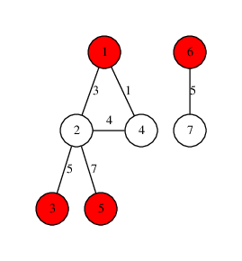

**时间限制：** 1.0 秒 


**空间限制：** 512 MB

[下载题目目录（样例文件）](examples/CSP201903-5.zip)


## 题目背景

“你在平原上走着走着，突然迎面遇到一堵墙，这墙向上无限高，向下无限深，向左无限远，向右无限远，这墙是什么？”——《流浪地球》原著

我们带着地球去流浪了，为了处理流浪过程中可能会发生的危机，联合政府找到你，希望你能协助完成317号子任务：制定应急预案。

## 题目描述

地球的表面有 $n$ 个据点，这些据点之间存在 $m$ 条双向道路。

这些据点中，有的是建立在行星发动机之下，受到行星发动机的保护（行星发动机据点），而其他据点则没有行星发动机的保护（普通据点，比如燃料采集据点/科研据点等）。

当发生危机的时候，没有行星发动机的保护是非常危险的，所以每个人都需要赶到最近的行星发动机据点寻求庇护，然而行星发动机据点也不一定安全，再加上行星发动机据点容量有限，所以有些时候得去第二近或者第三近的行星发动机据点。

联合政府找到你，希望你能够计算出每个据点最近的 $k$ 个行星发动机据点，为了简化问题，你只需要输出每个据点到最近 $k$ 个行星发动机据点的最短距离之和，如果某个据点能够到达的行星发动机据点不足 $k$ 个，则输出其能到达的所有行星发动机的最短距离之和。

## 输入格式

从标准输入读入数据。

输入的第一行包含三个用空格隔开的整数 $n,m,k$ ，含义见题目描述，保证 $1 \leq n \leq 10^{4}, 0 \leq m \leq 10^{4}, 1 \leq k \leq 10^{2}$。据点依次编号为 $1$ 到 $n$ 。

第二行包含 $n$ 个整数依次表示每个据点的类型，每个数为 $1$ 或 $0$ （ $1$ 表示对应据点为行星发动机据点， $0$ 表示普通据点）。

接下来 $m$ 行，每行三个整数 $u,v,w$ 表示有一条长度为 $w$ 的双向道路连接 $u$ 号据点和 $v$ 号据点， $1 \leq u,v \leq n, 1 \leq w \leq 10^{3}$ 。

可能有重边和自环。

## 输出格式

输出到标准输出。

输出 $n$ 行，每行输出一个整数表示答案（见题目描述）。


## 样例1输入

```plain
7 6 2
1 0 1 0 1 1 0
1 4 1
1 2 3
2 4 4
2 3 5
2 5 7
6 7 5

```


## 样例1输出

```plain
8
8
8
10
10
0
5

```


## 样例1解释

该样例的输入对应的图如下，其中红色点是行星发动机据点，白色点是普通据点。

  

 
	


<table class="table table-bordered"><thead><tr><th rowspan="1">据点</th><th rowspan="1">答案</th><th rowspan="1">说明</th></tr></thead><tbody><tr><td rowspan="1">1</td><td rowspan="3">8</td><td rowspan="1">最近的 $2$ 个行星发动机据点为 $1,3$ ，最短距离分别是 $0,8$</td></tr><tr><td rowspan="1">2</td><td rowspan="1">最近的 $2$ 个行星发动机据点为 $1,3$ ，最短距离分别是 $3,5$</td></tr><tr><td rowspan="1">3</td><td rowspan="1">最近的 $2$ 个行星发动机据点为 $1,3$ ，最短距离分别是 $8,0$</td></tr><tr><td rowspan="1">4</td><td rowspan="2">10</td><td rowspan="1">最近的 $2$ 个行星发动机据点为 $1,3$ ，最短距离分别是 $1,9$</td></tr><tr><td rowspan="1">5</td><td rowspan="1">最近的 $2$ 个行星发动机据点为 $1,5$ ，最短距离分别是 $10,0$</td></tr><tr><td rowspan="1">6</td><td rowspan="1">0</td><td rowspan="1">只能到达 $1$ 个行星发动机据点（6号据点），最短距离是 $0$</td></tr><tr><td rowspan="1">7</td><td rowspan="1">5</td><td rowspan="1">只能到达 $1$ 个行星发动机据点（6号据点），最短距离是 $5$</td></tr></tbody></table> 

## 子任务

* 对于 $30\\%$ 的数据： $1 \leq n \leq 500， 0 \leq m \leq 10^{4}, 1 \leq k \leq 10^{2}$
* 对于 $60\\%$ 的数据： $1 \leq n \leq 10^{4}, 0 \leq m \leq 10^{4}, 1 \leq k \leq 10^{2}$ , 保证行星发动机的数量和 $k$ 相同
* 对于 $100\\%$ 的数据： $1 \leq n \leq 10^{4}, 0 \leq m \leq 10^{4}, 1 \leq k \leq 10^{2}$