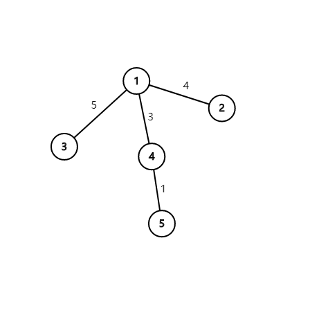

**时间限制：** 1.0 秒 


**空间限制：** 512 MiB

[下载题目目录（样例文件）](examples/CSP201909-5.zip)


## 题目描述

有一座城市，城市中有 $N$ 个公交站，公交站之间通过 $N-1$ 条道路连接，每条道路有相应的长度。保证所有公交站两两之间能够通过一唯一的通路互相达到。

两个公交站之间路径长度定义为两个公交站之间路径上所有边的边权和。

现在要对城市进行规划，将其中 $M$ 个公交站定为“重要的”。

现在想从中选出 $K$ 个节点，使得这 $K$ 个公交站两两之间路径长度总和最小。输出路径长度总和即可（节点编号从 $1$ 开始）。

## 输入格式

从标准输入读入数据。

第 $1$ 行包含三个正整数 $N$，$M$ 和 $K$ 分别表示树的节点数，重要的节点数，需要选出的节点数。

第 $2$ 行包含 $M$ 个正整数，表示 $M$ 个重要的节点的节点编号。

接下来 $N-1$ 行，每行包含三个正整数 $a$，$b$，$c$，表示编号为 $a$ 的节点与编号为 $b$ 的节点之间有一条权值为 $c$ 的无向边。
每行中相邻两个数之间用一个空格分隔。

## 输出格式

输出到标准输出。

输出只有一行，包含一个整数表示路径长度总和的最小值。


## 样例输入

```plain
5 3 2
1 3 5
1 2 4
1 3 5
1 4 3
4 5 1

```


## 样例输出

```plain
4

```


## 样例解释

  

样例中的树如上图所示。

重要的节点标号为 $1$，$3$，$5$，从中选出两个点，有三种方案：

方案 $1$：$1$，$3$ 之间路径长度为 $5$

方案 $2$：$1$，$5$ 之间路径长度为 $4$

方案 $3$：$3$，$5$ 之间路径长度为 $9$

## 子任务

 
	


<table class="table table-bordered"><thead><tr><th rowspan="1">测试点</th><th rowspan="1">$N$</th><th rowspan="1">$M$</th><th rowspan="1">$K$</th><th rowspan="1">$c$</th></tr></thead><tbody><tr><td rowspan="1">1, 2</td><td rowspan="1">$\leq 2,000$</td><td rowspan="1">$\leq 2,000$</td><td rowspan="1">$\leq 2$</td><td rowspan="4">$\leq 10^{5}$</td></tr><tr><td rowspan="1">3, 4</td><td rowspan="1">$\leq 5 \times 10^{4}$</td><td rowspan="1">$\leq 16$</td><td rowspan="1">$\leq 16$</td></tr><tr><td rowspan="1">5, 6, 7</td><td rowspan="1">$\leq 2,000$</td><td rowspan="1">$\leq 2,000$</td><td rowspan="2">$\leq 10^{2}$</td></tr><tr><td rowspan="1">8, 9, 10</td><td rowspan="1">$\leq 5 \times 10^{4}$</td><td rowspan="1">$\leq 10^{4}$</td></tr></tbody></table> 

对于所有的数据，$1\leq a,b \leq N$，$M \leq N$，$K \leq M$