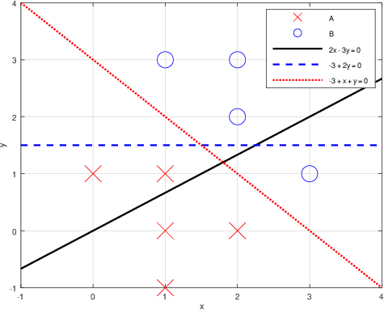

**时间限制：** 1.0 秒 


**空间限制：** 512 MiB

[下载题目目录（样例文件）](examples/CSP202006-1.zip)


## 题目描述

考虑一个简单的二分类问题——将二维平面上的点分为 `A` 和 `B` 两类。

训练数据包含 $n$ 个点，其中第 $i$ 个点（$1 \leq i \leq n$）可以表示为一个三元组 $(x_i,  y_i, type_i)$，即该点的横坐标、纵坐标和类别。

在二维平面上，任意一条直线可以表示为 $\theta_0 + \theta_1 x + \theta_2 y = 0$ 的形式，即由 $\theta_0$、$\theta_1$ 和 $\theta_2$ 三个参数确定该直线，且满足 $\theta_1$、$\theta_2$ 不同时为 $0$。

基于这 $n$ 个已知类别的点，我们想要在平面上找到一条直线作为一个线性分类器。具体来说，这条线要把训练数据中的 `A`、`B` 两类点**完美分隔**开来，即一侧只有 `A` 类点、另一侧只有 `B` 类点。这样，对于任意一个的未知类别的点，我们就可以根据它是位于直线的哪一侧来预测它的类别了。

在本题中我们仅需要处理 $m$ 个如下查询：给定一条直线，判断它是否能将训练数据中的 `A`、`B` 两类点完美分开。

## 输入格式

从标准输入读入数据。

输入共 $n+m+1$ 行。

第一行包含用空格分隔的两个正整数 $n$ 和 $m$，分别表示点和查询的个数。

第二行到第 $n+1$ 行依次输入 $n$ 个点的信息。第 $i+1$ 行（$1 \leq i \leq n$）包含用空格分隔的三项 $x_i$、$y_i$ 和 $type_i$，分别表示第 $i$ 个点的横、纵坐标和类别，其中坐标为整数、类别为一个大写英文字母 `A` 或 `B`。

第 $n+2$ 行到第 $n+m+1$ 行依次输入 $m$ 个查询。第 $j+n+1$ 行（$1 \leq j \leq m$）包含用空格分隔的三个整数 $\theta_0$、$\theta_1$ 和 $\theta_2$，表示第 $j$ 个查询中给定直线的三个参数。

## 输出格式

输出到标准输出。

输出共 $m$ 行，每行输出一个字符串。

第 $j$ 行（$1 \leq j \leq m$）输出的字符串对应第 $j$ 个查询的结果：如果给定直线可以完美分隔 `A`、`B` 两类点，则输出 `Yes`；否则输出 `No`。


## 样例1输入

```plain
9 3
1 1 A
1 0 A
1 -1 A
2 2 B
2 3 B
0 1 A
3 1 B
1 3 B
2 0 A
0 2 -3
-3 0 2
-3 1 1

```


## 样例1输出

```plain
No
No
Yes
```


## 样例1解释

只有第 $3$ 个查询给出的直线能将 `A`、`B` 两类点完美分隔。

  

## 子任务

* 输入数据保证**不存在**恰好落在给定直线上的点；

* $0 < n \leq 10^{3}$、$0 < m \leq 20$，且 `A`、`B` 两类点的数量均不为 $0$；

* 所有点的坐标和给定直线的三个参数均为整数，且绝对值 $\leq 10^{4}$；

* 任意两个点的坐标不完全相同。

 
	


<table class="table table-bordered"><thead><tr><th rowspan="1">测试点</th><th rowspan="1">$\theta_0$</th><th rowspan="1">$\theta_1$</th><th rowspan="1">$\theta_2$</th></tr></thead><tbody><tr><td rowspan="1">1,2,3,4,5</td><td rowspan="2">不为零</td><td rowspan="1">$= 0$</td><td rowspan="1">不为零</td></tr><tr><td rowspan="1">6,7,8,9,10</td><td rowspan="3">不为零</td><td rowspan="1">$= 0$</td></tr><tr><td rowspan="1">11,12,13,14,15</td><td rowspan="1">$= 0$</td><td rowspan="2">不为零</td></tr><tr><td rowspan="1">16,17,18,19,20</td><td rowspan="1">不为零</td></tr></tbody></table> 