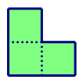
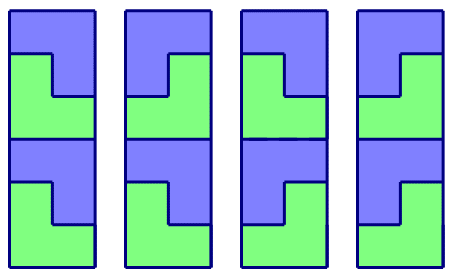

## 问题描述


给出一个n&times;m的方格图，现在要用如下L型的积木拼到这个图中，使得方格图正好被拼满，请问总共有多少种拼法。其中，方格图的每一个方格正好能放积木中的一块。积木可以任意旋转。



## 输入格式


输入的第一行包含两个整数n, m，表示方格图的大小。


## 输出格式


输出一行，表示可以放的方案数，由于方案数可能很多，所以请输出方案数除以1,000,000,007的余数。


## 样例输入
```
6 2
```
## 样例输出
```
4
```
## 样例说明

四种拼法如下图所示：




## 评测用例规模与约定

在评测时将使用10个评测用例对你的程序进行评测。

评测用例1和2满足：1&lt;=n&lt;=30，m=2。

评测用例3和4满足：1&lt;=n, m&lt;=6。

评测用例5满足：1&lt;=n&lt;=100，1&lt;=m&lt;=6。

评测用例6和7满足：1&lt;=n&lt;=1000，1&lt;=m&lt;=6。

评测用例8、9和10满足：1&lt;=n&lt;=10^15，1&lt;=m&lt;=7。
