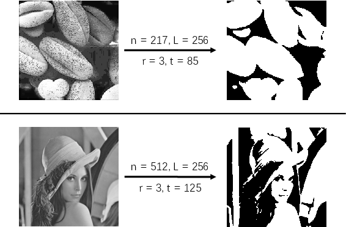

**时间限制：** 1.0 秒 


**空间限制：** 512 MiB

[下载题目目录（样例文件）](examples/CSP202104-2.zip)


## 题目背景

顿顿在学习了数字图像处理后，想要对手上的一副灰度图像进行降噪处理。不过该图像仅在较暗区域有很多噪点，如果贸然对全图进行降噪，会在抹去噪点的同时也模糊了原有图像。因此顿顿打算先使用**邻域均值**来判断一个像素是否处于**较暗区域**，然后仅对处于**较暗区域**的像素进行降噪处理。

## 题目描述

待处理的灰度图像长宽皆为 $n$ 个像素，可以表示为一个 $n \times n$ 大小的矩阵 $A$，其中每个元素是一个 $[0, L)$ 范围内的整数，表示对应位置像素的灰度值。
对于矩阵中任意一个元素 $A_{ij}$（$0 \leq i, j < n$），其**邻域**定义为附近若干元素的集和：$Neighbor(i, j, r) = \\{ A_{xy}|0 \leq x, y < n\ \mathrm{and}\ |x-i| \leq r\ \mathrm{and}\ |y-j| \leq r \\}$
这里使用了一个额外的参数 $r$ 来指明 $A_{ij}$ 附近元素的具体范围。根据定义，易知 $Neighbor(i, j, r)$ 最多有 $(2r+1)^2$ 个元素。

如果元素 $A_{ij}$ **邻域**中所有元素的**平均值**小于或等于一个给定的阈值 $t$，我们就认为该元素对应位置的像素处于**较暗区域**。
下图给出了两个例子，左侧图像的较暗区域在右侧图像中展示为黑色，其余区域展示为白色。

  

现给定邻域参数 $r$ 和阈值 $t$，试统计输入灰度图像中有多少像素处于**较暗区域**。

## 输入格式

从标准输入读入数据。

输入共 $n + 1$ 行。

输入的第一行包含四个用空格分隔的正整数 $n$、$L$、$r$ 和 $t$，含义如前文所述。

第二到第 $n + 1$ 行输入矩阵 $A$。
第 $i + 2$（$0 \leq i < n$）行包含用空格分隔的 $n$ 个整数，依次为 $A_{i0}, A_{i1}, \cdots, A_{i(n-1)}$。

## 输出格式

输出到标准输出。

输出一个整数，表示输入灰度图像中处于较暗区域的像素总数。


## 样例1输入

```plain
4 16 1 6
0 1 2 3
4 5 6 7
8 9 10 11
12 13 14 15
```


## 样例1输出

```plain
7
```


## 样例2输入

```plain
11 8 2 2
0 0 0 0 0 0 0 0 0 0 0
0 0 0 0 0 0 0 0 0 0 0
0 7 0 0 0 7 0 0 7 7 0
7 0 7 0 7 0 7 0 7 0 7
7 0 0 0 7 0 0 0 7 0 7
7 0 0 0 0 7 0 0 7 7 0
7 0 0 0 0 0 7 0 7 0 0
7 0 7 0 7 0 7 0 7 0 0
0 7 0 0 0 7 0 0 7 0 0
0 0 0 0 0 0 0 0 0 0 0
0 0 0 0 0 0 0 0 0 0 0
```


## 样例2输出

```plain
83
```


## 子任务

$70\\%$ 的测试数据满足 $n \leq 100$、$r \leq 10$。

全部的测试数据满足 $0 < n \leq 600$、$0 < r \leq 100$ 且 $2 \leq t < L \leq 256$。