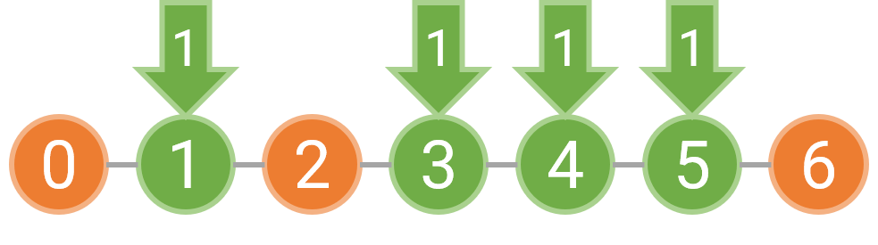

**时间限制：** 1.0 秒 


**空间限制：** 512 MiB

[下载题目目录（样例文件）](examples/CSP202104-4.zip)


## 题目描述

X 校最近打算美化一下校园环境。前段时间因为修地铁，X 校大门外种的行道树全部都被移走了。现在 X 校打算重新再种一些树，为校园增添一抹绿意。

X 校大门外的道路是东西走向的，我们可以将其看成一条数轴。在这条数轴上有 $n$ 个障碍物，例如电线杆之类的。虽然障碍物会影响树的生长，但是障碍物不一定能被随便移走，所以 X 校规定在障碍物的位置上**不能**种树。$n$ 个障碍物的坐标都是整数；如果规定向东为正方向，则 $n$ 个障碍物的坐标按照从西到东的顺序分别为 $a_1, a_2, \cdots, a_n$。X 校打算在 $[a_1, a_n]$ 之间种一些树，使得这些树看起来比较美观。

X 校希望，在一定范围内，树应该是等间隔的。更具体地说，如果把 $[a_1, a_n)$ 划分成一些区间 $[a_{p_1}, a_{p_2}),\cdots,[a_{p_{m-1}},a_{p_m})$（$1=p_1<p_2<\cdots<p_m=n$），那么每个区间 $[a_{p_i},a_{p_{i+1}})$ 内需要至少种一棵树，且该区间内种的树的坐标连同区间端点 $a_{p_i}, a_{p_{i+1}}$ 应该构成一个等差数列。不同区间的公差，也就是树的间隔可以不相同。

例如，如果障碍物位于 $0, 2, 6$ 这三处，那么我们可以选择在 $[0, 2)$ 和 $[2, 6)$ 分别种树，也可以选择在 $[0, 6)$ 等间隔种树。如果是分别在 $[0, 2)$ 和 $[2, 6)$ 种树，由于每个区间内至少要种一棵树，坐标 $1$ 上必须种树；而 $[2, 6)$ 上的树可以按照 $1$ 的间隔种下，也可以按照 $2$ 的间隔种下。下图表示了这两种美观的种树方案，其中橙色的圆表示障碍物，绿色的圆表示需要在这个位置种树，箭头上的数字表示种下这棵树时对应的间隔为多少。

  

  

而如果选择在 $[0, 6)$ 区间等间隔种树，我们只能以 $3$ 的间隔种树，因为无论是选择间隔 $1$ 或者间隔 $2$，都需要在坐标 $2$ 上种树，而这个位置已经有障碍物了。下图分别表示了间隔为 $3, 2, 1$ 时的种树情况，红色箭头表示不能在这里种树。

  

  

  

一般地，给定一个区间 $[a_l, a_r)$，对于树的坐标的集合 $T\subset(a_l, a_r)$（$T\subset\mathbb{Z}$），归纳定义 $T$ 在 $[a_l, a_r)$ 上是**美观的**：

1. 如果 $T\ne\varnothing$，$T\cap \{a_l, a_{l+1}, \cdots, a_r\}=\varnothing$，并且存在一个公差 $d\geq 1$，使得 $T\cup\{a_l, a_r\}$ 中的元素按照从小到大的顺序排序后，可以构成一个公差为 $d$ 的等差数列（显然，这个等差数列的首项为 $a_l$，末项为 $a_r$），则 $T$ 在 $[a_l, a_r)$ 上是美观的；
2. 如果 $T\cap \{a_l, a_{l+1}, \cdots, a_r\}=\varnothing$，并且存在一个下标 $m$（$l<m<r$），使得 $T\cap(a_l, a_m)$ 在 $[a_l, a_m)$ 上是美观的，且 $T\cap(a_m, a_r)$ 在 $[a_m, a_r)$ 上是美观的，则 $T$ 在 $[a_l, a_r)$ 上是美观的。

根据这一定义，空集在任意区间上都不是美观的；另外，如果存在下标 $i$ 使得 $a_i \in T$，那么 $T$ 一定不是美观的。

我们称两种种树的方案是**本质不同的**，当且仅当两种方案中，种树的坐标集合不同。请帮助 X 校对 $[a_1, a_n)$ 求出所有本质不同的美观的种树方案。当然，由于方案可能很多，你只需要输出总方案数对 $10^9+7$ 取模的结果。

## 输入格式

从标准输入读入数据。

输入的第一行包含一个正整数 $n$，表示障碍物的数量。

输入的第二行包括 $n$ 个非负整数 $a_1, \cdots, a_n$，表示每个障碍物的坐标。

保证对 $i=1, 2, \cdots, n-1$，$a_i < a_{i+1}$。

## 输出格式

输出到标准输出。

输出一个非负整数，表示本质不同的美观的种树方案的数量对 $10^9+7$ 取模的结果。


## 样例1输入

```plain
3
0 2 6

```


## 样例1输出

```plain
3

```


## 样例1解释

这组样例即为题面描述中提到的那组。


## 样例2输入

```plain
11
0 10 20 30 40 50 60 70 80 90 100

```


## 样例2输出

```plain
256507

```


## 样例3

见题目目录下的 *3.in* 与 *3.ans*。

## 子任务

对于 $10\\%$ 的数据，保证 $n=2$；

对于 $30\\%$ 的数据，保证 $n\leq 10$；

对于 $60\\%$ 的数据，保证 $n\leq 100, a_i \leq 1000$；

对于 $100\\%$ 的数据，保证 $2\leq n \leq 1000, 0\leq a_i \leq 100,000$，且至少存在一种美观的种树方案。