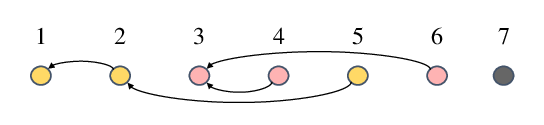

**时间限制：** 1.0 秒 


**空间限制：** 512 MiB

[下载题目目录（样例文件）](examples/CSP202212-2.zip)


## 题目背景

西西艾弗岛荒野求生大赛还有 $n$ 天开幕！

## 题目描述

为了在大赛中取得好成绩，顿顿准备在 $n$ 天时间内完成“短跑”、“高中物理”以及“核裂变技术”等总共 $m$ 项科目的加强训练。
其中第 $i$ 项（$1 \leq i \leq m$）科目编号为 $i$，也可简称为科目 $i$。
已知科目 $i$ 耗时 $t_i$ 天，即如果从第 $a$ 天开始训练科目 $i$，那么第 $a + t_i - 1$ 天就是该项训练的最后一天。

大部分科目的训练可以同时进行，即顿顿在同一天内可以同时进行多项科目的训练，但部分科目之间也存在着依赖关系。
如果科目 $i$ 依赖科目 $j$，那么只能在后者训练结束后，科目 $i$ 才能开始训练。
具体来说，如果科目 $j$ 从第 $a$ 天训练到第 $a + t_j - 1$ 天，那么科目 $i$ 最早只能从第 $a + t_j$ 天开始训练。
还好，顿顿需要训练的 $m$ 项科目依赖关系并不复杂，每项科目最多只依赖一项别的科目，且满足依赖科目的编号小于自己。
那些没有任何依赖的科目，则可以从第 $1$ 天就开始训练。

对于每一项科目，试计算：

1）最早开始时间：该科目最早可以于哪一天开始训练？

2）最晚开始时间：在不耽误参赛的前提下（$n$ 天内完成所有训练），该科目最晚可以从哪一天开始训练？

$n$ 天内完成所有训练，即每一项科目训练的最后一天都要满足 $\leq n$。
需要注意，顿顿如果不能在 $n$ 天内完成全部 $m$ 项科目的训练，就无法参加大赛。
这种情况下也就不需要再计算“最晚开始时间”了。

## 输入格式

从标准输入读入数据。

输入共三行。

输入的第一行包含空格分隔的两个正整数 $n$ 和 $m$，分别表示距离大赛开幕的天数和训练科目的数量。

输入的第二行包含空格分隔的 $m$ 个整数，其中第 $i$ 个（$1 \leq i \leq m$）整数 $p_i$ 表示科目 $i$ 依赖的科目编号，满足 $0 \leq p_i < i$；$p_i = 0$ 表示科目 $i$ 无依赖。

输入的第三行包含空格分隔的 $m$ 个正整数，其中第 $i$ 个（$1 \leq i \leq m$）数 $t_i$ 表示训练科目 $i$ 所需天数，满足 $1 \leq t_i \leq n$。

## 输出格式

输出到标准输出。

输出共一行或两行。

输出的第一行包含空格分隔的 $m$ 个正整数，依次表示每项科目的最早开始时间。

如果顿顿可以在 $n$ 天内完成全部 $m$ 项科目的训练，则继续输出第二行，否则输出到此为止。

输出的第二行包含空格分隔的 $m$ 个正整数，依次表示每项科目的最晚开始时间。


## 样例1输入

```plain
10 5
0 0 0 0 0
1 2 3 2 10
```


## 样例1输出

```plain
1 1 1 1 1
10 9 8 9 1
```


## 样例1解释

五项科目间没有依赖关系，都可以从第 $1$ 天就开始训练。

$10$ 天时间恰好可以完成所有科目的训练。其中科目 $1$ 耗时仅 $1$ 天，所以最晚可以拖延到第 $10$ 天再开始训练；而科目 $5$ 耗时 $10$ 天，必须从第 $1$ 天就开始训练。


## 样例2输入

```plain
10 7
0 1 0 3 2 3 0
2 1 6 3 10 4 3
```


## 样例2输出

```plain
1 3 1 7 4 7 1
```


## 样例2解释

七项科目间的依赖关系如图所示，其中仅科目 $5$ 无法在 $10$ 天内完成训练。

  

具体来说，科目 $5$ 依赖科目 $2$、科目 $2$ 又依赖于科目 $1$，因此科目 $5$ 最早可以从第 $4$ 天开始训练。


## 样例3输入

```plain
10 5
0 1 2 3 4
10 10 10 10 10
```


## 样例3输出

```plain
1 11 21 31 41
```


## 子任务

$70\\%$ 的测试数据满足：顿顿无法在 $n$ 天内完成全部 $m$ 项科目的训练，此时仅需输出一行“最早开始时间”；

全部的测试数据满足 $0 < n \leq 365$ 且 $0 < m \leq 100$。