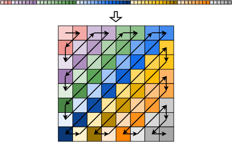

**时间限制：** 1.0 秒 


**空间限制：** 512 MiB

[下载题目目录（样例文件）](examples/CSP202212-3.zip)


## 题目背景

四年一度的世界杯即将画上尾声。在本次的世界杯比赛中，视频助理裁判（Video Assistant Referee, VAR）的应用可谓是大放异彩。VAR 使用视频回放技术帮助主裁判作出正确判罚决定。
西西艾弗岛足球联赛的赛场上也引入了一套 VAR 设备。作为技术供应商的技术主管小C，需要存储和编码 VAR 产生的图像数据。小 C 分析比较发现，JPEG 编码算法可以达到较好的压缩效果，
并且质量损失是可以接受的。因此，小 C 决定使用 JPEG 编码算法来存储和传输图像数据。JPEG 是一种常用的图片有损压缩算法，它的压缩率高，但是压缩后的图片质量下降较多。JPEG 图片的压缩率一般在 10:1 到 20:1 之间，一般用于存储照片等图片质量要求不高的场景。

为了简化问题，我们以灰度图片为例，介绍 JPEG 编码算法的过程。一张灰度图片，可以被视为由多个像素点组成。每个像素点对应一个 0 到 255 之间的数值，用于表示像素点的亮度。JPEG 编码算法将图片分割为 $8 \times 8$ 的小块，每个小块被称作一个最小编码单元。对每个小块进行如下的计算：

1. 将每个像素点的数值减去 128，使得每个像素点的数值都在 -128 到 127 之间。
2. 将每个小块的像素点排成一个 $8 \times 8$ 的矩阵，并对矩阵进行离散余弦变换（DCT）。进行离散余弦变换后，仍然得到一个 $8 \times 8$ 的矩阵，矩阵中的每个元素都是实数，并且所得矩阵的左上方的数字的绝对值较大，右下方的数字的绝对值较小，甚至接近 0。
3. 对矩阵进行量化操作。量化操作是指将矩阵中的每个元素都除以一个数字，并取整数。量化操作的目的是为了减少矩阵中的数据，从而减少编码后的文件大小。量化操作的数字越大，矩阵中的数据就越少，但是压缩后的图片质量也会越差。
4. 对矩阵进行 Z 字形扫描。Z 字形扫描是指从左上角开始，沿着 Z 字形的路径扫描矩阵中的元素，将扫描到的元素依次排成一个数组，由于 Z 字形扫描的路径是从左上角到右下角，数组结尾处可能存在着连续的 0，为了节省空间，可以不存储这些连续的 0。得到的数据被称为扫描数据。

最后，将得到的各个小块的扫描数据采用哈夫曼编码进行压缩，并置于必要的数据结构中，就能得到一张 JPEG 图片了。

## 题目描述

在本题中，你需要实现一个能够解码 JPEG 图片的一个最小编码单元的程序。解码的步骤与上述编码的步骤相反，具体的步骤是：

1. 读入量化矩阵 $Q_{i,j}$，其中 $i, j$ 的取值范围为 $0 \sim 7$。
2. 初始化一个 $8 \times 8$ 的矩阵 $M$，令 $M_{i,j} = 0$。
3. 读入扫描数据，将扫描数据按照这样的顺序写入矩阵 $M$：从左上角 $M_{0,0}$ 开始，接下来填充它的右侧相邻的元素 $M_{0,1}$，然后依次向左下方填充直至 $M_{1,0}$，接下来从它下侧相邻的元素 $M_{2,0}$ 开始，依次向右上方填充直至 $M_{0, 2}$，依次类推，循环往复，直至填充满整个矩阵或用尽所有扫描数据，如图所示。
   
     

4. 将矩阵 $M$ 中的每个元素都乘以量化矩阵 $Q$ 中的对应元素。
5. 对矩阵 $M$ 进行离散余弦逆变换，得到一个 $8 \times 8$ 的矩阵 $M'$。其中，逆变换的公式如下：

$M'\_{i,j} = \frac{1}{4} \sum_{u=0}^{7} \sum_{v=0}^{7} \alpha(u) \alpha(v) M_{u,v} \cos ( \frac{\pi}{8} ( i + \frac{1}{2} ) u ) \cos ( \frac{\pi}{8} ( j + \frac{1}{2} ) v )$

   其中 $\alpha(u) = \begin{cases} \sqrt{\frac{1}{2}} & u = 0 \\\\ 1 & u \neq 0 \end{cases}$
   
6. 将矩阵 $M'$ 中的每个元素都加上 $128$，并取最接近的整数（四舍五入）。如果得到的整数大于 $255$，则取 $255$；如果得到的整数小于 $0$，则取 $0$。得到的矩阵即为解码后的图片。

例如，假设给定的量化矩阵是：

$$ \begin{bmatrix}
16 & 11 & 10 & 16 & 24 & 40 & 51 & 61 \\\\
12 & 12 & 14 & 19 & 26 & 58 & 60 & 55 \\\\
14 & 13 & 16 & 24 & 40 & 57 & 69 & 56 \\\\
14 & 17 & 22 & 29 & 51 & 87 & 80 & 62 \\\\
18 & 22 & 37 & 56 & 68 & 109 & 103 & 77 \\\\
24 & 35 & 55 & 64 & 81 & 104 & 113 & 92 \\\\
49 & 64 & 78 & 87 & 103 & 121 & 120 & 101 \\\\
72 & 92 & 95 & 98 & 112 & 100 & 103 & 99 \\\\
\end{bmatrix} $$

给出的扫描数据是：-26, -3, 0, -3, -2, -6, 2, -4, 1, -3, 1, 1, 5, 1, 2, -1, 1, -1, 2, 0, 0, 0, 0, 0, -1 -1，那么填充后的矩阵 $M$ 是：

$$ \begin{bmatrix}
-26 & -3 & -6 & 2 & 2 & -1 & 0 & 0 \\\\
0 & -2 & -4 & 1 & 1 & 0 & 0 & 0 \\\\
-3 & 1 & 5 & -1 & -1 & 0 & 0 & 0 \\\\
-3 & 1 & 2 & -1 & 0 & 0 & 0 & 0 \\\\
1 & 0 & 0 & 0 & 0 & 0 & 0 & 0 \\\\
0 & 0 & 0 & 0 & 0 & 0 & 0 & 0 \\\\
0 & 0 & 0 & 0 & 0 & 0 & 0 & 0 \\\\
0 & 0 & 0 & 0 & 0 & 0 & 0 & 0 \\\\
\end{bmatrix} $$

与量化矩阵逐项相乘后的矩阵是：

$$ \begin{bmatrix}
-416 & -33 & -60 & 32 & 48 & -40 & 0 & 0 \\\\
0 & -24 & -56 & 19 & 26 & 0 & 0 & 0 \\\\
-42 & 13 & 80 & -24 & -40 & 0 & 0 & 0 \\\\
-42 & 17 & 44 & -29 & 0 & 0 & 0 & 0 \\\\
18 & 0 & 0 & 0 & 0 & 0 & 0 & 0 \\\\
0 & 0 & 0 & 0 & 0 & 0 & 0 & 0 \\\\
0 & 0 & 0 & 0 & 0 & 0 & 0 & 0 \\\\
0 & 0 & 0 & 0 & 0 & 0 & 0 & 0 \\\\
\end{bmatrix} $$

经过离散余弦逆变换后的矩阵 $M'$ 是：

$$ \begin{bmatrix}
-65.83 & -62.63 & -71.04 & -68.04 & -55.65 & -64.99 & -68.37 & -45.72 \\\\
-70.87 & -72.59 & -72.07 & -45.82 & -20.30 & -40.63 & -65.74 & -57.11 \\\\
-70.40 & -78.12 & -68.13 & -17.40 & 19.72 & -14.45 & -60.84 & -63.38 \\\\
-63.00 & -73.21 & -61.78 & -7.56 & 26.97 & -13.59 & -60.21 & -57.75 \\\\
-58.02 & -65.09 & -61.36 & -27.06 & -6.29 & -40.45 & -67.70 & -50.14 \\\\
-57.26 & -57.09 & -64.34 & -57.62 & -48.02 & -65.58 & -72.36 & -47.25 \\\\
-53.45 & -45.52 & -60.89 & -73.60 & -64.55 & -63.43 & -62.21 & -44.67 \\\\
-47.14 & -34.38 & -53.26 & -73.78 & -60.19 & -47.06 & -46.88 & -40.80 \\\\
\end{bmatrix} $$

经过加 $128$ 后并取整的矩阵是：

$$ \begin{bmatrix}
62 & 65 & 57 & 60 & 72 & 63 & 60 & 82 \\\\
57 & 55 & 56 & 82 & 108 & 87 & 62 & 71 \\\\
58 & 50 & 60 & 111 & 148 & 114 & 67 & 65 \\\\
65 & 55 & 66 & 120 & 155 & 114 & 68 & 70 \\\\
70 & 63 & 67 & 101 & 122 & 88 & 60 & 78 \\\\
71 & 71 & 64 & 70 & 80 & 62 & 56 & 81 \\\\
75 & 82 & 67 & 54 & 63 & 65 & 66 & 83 \\\\
81 & 94 & 75 & 54 & 68 & 81 & 81 & 87 \\\\
\end{bmatrix} $$


## 输入格式

从标准输入读入数据。

输入的前 8 行，每行有空格分隔 8 个正整数，是量化矩阵。

接下来的 1 行是 1 个正整数 $n$，表示扫描数据的个数。

接下来的 1 行是 1 个数字 $T$，取值为 0、1 或 2，表示要进行的任务。

接下来的 1 行，有空格分隔的 $n$ 个整数，是扫描数据。

## 输出格式

输出到标准输出。

输出共 8 行，每行有 8 个空格分隔的整数，表示一个图像矩阵。

当 $T$ 取 0 时，输出填充（步骤 3）后的图像矩阵；当 $T$ 取 1 时，输出量化（步骤 4）后的图像矩阵；当 $T$ 取 2 时，输出最终的解码结果。


## 样例1输入

```plain
16 11 10 16 24 40 51 61
12 12 14 19 26 58 60 55
14 13 16 24 40 57 69 56
14 17 22 29 51 87 80 62
18 22 37 56 68 109 103 77
24 35 55 64 81 104 113 92
49 64 78 87 103 121 120 101
72 92 95 98 112 100 103 99
26
2
-26 -3 0 -3 -2 -6 2 -4 1 -3 1 1 5 1 2 -1 1 -1 2 0 0 0 0 0 -1 -1
```


## 样例1输出

```plain
62 65 57 60 72 63 60 82
57 55 56 82 108 87 62 71
58 50 60 111 148 114 67 65
65 55 66 120 155 114 68 70
70 63 67 101 122 88 60 78
71 71 64 70 80 62 56 81
75 82 67 54 63 65 66 83
81 94 75 54 68 81 81 87

```


## 样例1解释

本组样例即为题目描述中的样例。

## 子任务

对于 20% 的数据，有 $T = 0$；

对于 40% 的数据，有 $T = 0$ 或 $1$；

对于 40% 的数据，有 $T \in \{0, 1, 2\}$，且 $n \in [0, 64]$，并且量化矩阵中的各个元素 $q_{i,j}$ 满足 $0 < q_{i,j} < 256$，扫描序列中的各个元素 $m_i$ 满足 $-256 < m_i < 256$。

## 提示

在 C/C++ 语言中，可以通过包含 `math.h`（C 语言）或 `cmath`（C++ 语言）来使用数学函数。
$\pi$ 的值可以通过表达式 `acos(-1)` 获得。

在 Python 语言中，可以通过 `from math import pi` 引入 $\pi$。

在 Java 语言中，可以使用 `Math.PI` 来获取 $\pi$ 的值.