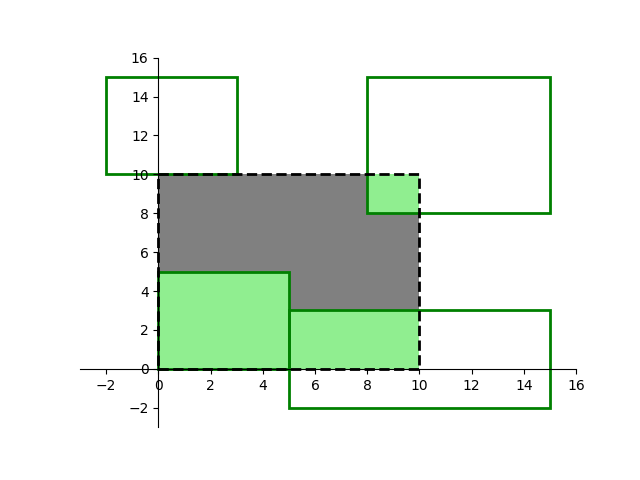

**时间限制：** 1.0 秒 


**空间限制：** 512 MiB

[下载题目目录（样例文件）](examples/CSP202303-1.zip)


## 题目描述

西西艾弗岛上散落着 $n$ 块田地。每块田地可视为平面直角坐标系下的一块矩形区域，由左下角坐标 $(x_1, y_1)$ 和右上角坐标 $(x_2, y_2)$ 唯一确定，且满足 $x_1 < x_2$、$y_1 < y_2$。这 $n$ 块田地中，任意两块的交集面积均为 $0$，仅边界处可能有所重叠。

最近，顿顿想要在南山脚下开垦出一块面积为 $a \times b$ 矩形田地，其左下角坐标为 $(0, 0)$、右上角坐标为 $(a, b)$。试计算顿顿选定区域内已经存在的田地面积。

## 输入格式

从标准输入读入数据。

输入共 $n+1$ 行。

输入的第一行包含空格分隔的三个正整数 $n$、$a$ 和 $b$，分别表示西西艾弗岛上田地块数和顿顿选定区域的右上角坐标。

接下来 $n$ 行，每行包含空格分隔的四个整数 $x_1$、$y_1$、$x_2$ 和 $y_2$，表示一块田地的位置。

## 输出格式

输出到标准输出。

输出一个整数，表示顿顿选定区域内的田地面积。


## 样例输入

```plain
4 10 10
0 0 5 5
5 -2 15 3
8 8 15 15
-2 10 3 15
```


## 样例输出

```plain
44
```


## 样例解释

如图所示，选定区域内田地（绿色区域）面积为 $44$。

  

## 子任务

全部的测试数据满足 $n \leq 100$，且所有输入坐标的绝对值均不超过 $10^{4}$。
