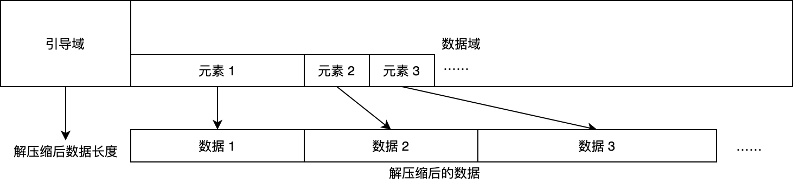
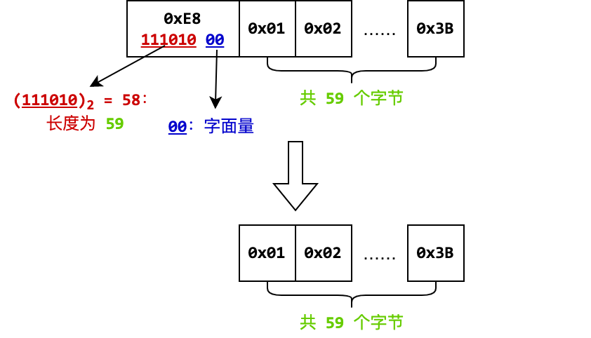
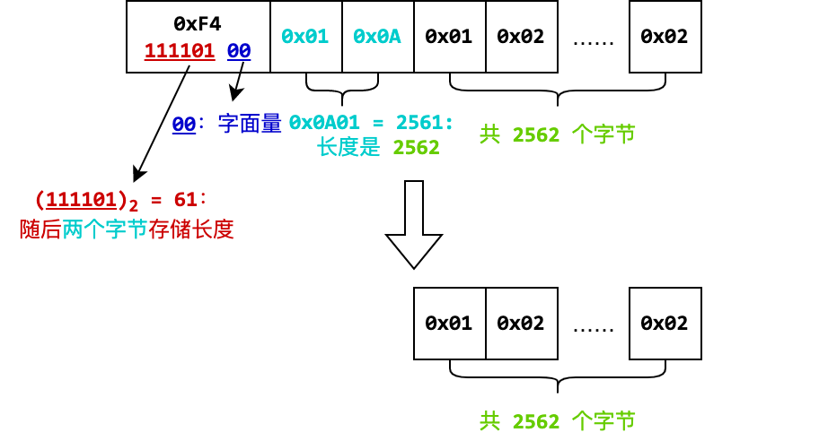
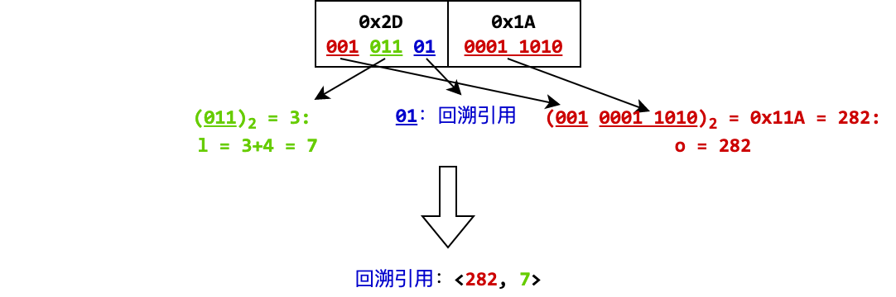
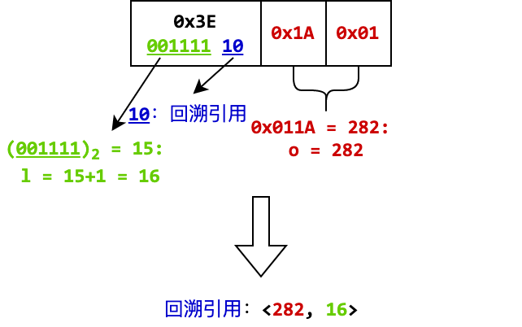

**时间限制：** 5.0 秒 


**空间限制：** 512 MiB

[下载题目目录（样例文件）](examples/CSP202305-3.zip)


## 题目背景

西西艾弗岛运营公司是一家负责维护和运营岛上基础设施的大型企业。在公司内，有许多分管不同业务的部门都需要使用到服务器设施。为了便于管理，同时降低公司运行成本，
西西艾弗岛运营公司建设了一套私有云系统。这套私有云系统除了能提供托管的虚拟机服务外，还能提供一些其他的服务。其中，最受好评的当属日志服务。此前，各个业务系统的日志都是分散存放在各自的服务器上的，
这样不仅不方便查看和分析而且也有丢失的风险。而日志服务则能够将各个业务系统的日志统一收集起来，方便查看和管理。

日志服务器收集到的日志都是纯文本，且高度格式化。这意味着日志数据可以被压缩得非常小。但是日志数据量非常大，且对处理效率的要求较高，因此可以牺牲一定的压缩率，使用高效的压缩算法来压缩日志数据。
小 C 被安排来实现解压缩日志的程序，给定一段被压缩的日志数据，他需要将其解压缩。

## 题目描述

这种压缩算法产生的数据流，可以被视为是一系列的元素。元素分为两种：字面量和回溯引用。字面量包含一系列的字节，对其进行解压缩时，直接将这些字节输出即可。
回溯引用则是将此前已经解压缩得到的数据流的一部分重复输出。回溯引用可以表示为 $\langle o, l\rangle$，包含两个数字，分别为偏移量 $o$ 和长度 $l$。
偏移量表示从当前位置向前回溯的距离，长度表示需要重复输出的字节数。其中要求 $o,l > 0$。若已经解压缩了 $p$ 字节，当 $o \geq l$ 时，
表示重复输出自偏移量 $(p-o)$（首个字节偏移量为 0）开始的 $l$ 个字节。例如，已经解压缩的数据流是 `abcde`，则回溯引用 $\langle 3, 2\rangle$ 表示输出 `cd`。
当 $o < l$ 时，表示重复输出自偏移量 $(p-o)$ 开始的的 $o$ 个字节，然后继续反复输出这 $o$ 个字节，直到共输出 $l$ 个字节。例如，已经解压缩的数据流是 `abcde`，
则回溯引用 $\langle 2, 5\rangle$ 表示输出 `deded`。

被压缩的数据格式分为两部分：导引域和数据域。其中导引域保存了原始数据的长度。设原始数据长度为 $n$。则 $n$ 可以表示为 $\sum_{k=0}^d c_k \times 128^k$，其中 $0 \leq c_k < 128$，且
$c_d \not=0$。导引域的长度为 $(d+1)$ 字节，依次保存 $c_0 + 128, c_1 + 128, \cdots, c_{d-1} + 128, c_d$。即每个字节用低 7 位保存 $c_k$，除了最后一个字节的最高位为 0，
其余字节的最高位为 1。例如，原始数据的长度为 1324，那么 $c_k$ 依次为：44、10，即 16 进制的 `0x2C`、`0x0A`。因此引导区的长度为 2，字节序列为 `0xAC 0x0A`。

  

数据域保存了被压缩后的数据，是连续存储的元素的序列。每个元素的第一个字节的最低两位表示了元素的类型。当最低两位为 0 时，表示这是一个字面量。如果字面量包含的字节个数为 $l$，且 $l \leq 60$，
那么第一个字节的高 6 位表示 $(l - 1)$。随后的 $l$ 字节即为字面量所包含的原始字节。例如字节 `0xE8`，其二进制为 `1110 1000`，低二位是 0，表示这是一个字面量。高六位是 `111010`，表示数字 58，
即表示该字面量包含 59 个字节。因此，该字节后面的 59 个字节即为字面量所包含的原始字节。如果 $l > 60$，那么则将 $(l - 1)$ 用小端序的 1 至 4 个字节表示，存储于第一个字节的后面。
第一个字节的高六位存储的值为 60、61、62 或 63 时，分别代表 $(l - 1)$ 用 1、2、3 或 4 个字节表示。例如，字节序列 `0xF4 0x01 0x0A` 中，首字节的二进制为 `1111 0100`，低二位是 0，表示这是一个字面量。
高 6 位是 `111101`，表示数字 61，即表示随后有两个字节存储了字面量的长度。随后的两个字节 `0x01 0x0A`，按小端序组成了十六进制数 `0x0A01`，即十进制 2561，表示该字面量包含 2562 个字节。
随后的 2562 个字节即为字面量所包含的原始字节。

  
  

当元素首字节的最低两位是 `01` 时，表示这是一个回溯引用 $\langle o, l\rangle$，且 $4 \leq l \leq 11, 0 < o \leq 2047$。此时，$o$ 占 11 位，其低 8 位存储于随后的字节中，
高 3 位存储于首字节的高 3 位中。$(l-4)$ 占 3 位，存储于首字节的 2 至 4 位中。如下图所示：

```
 7 6 5 4 3 2 1 0   7 6 5 4 3 2 1 0
+-----+-----+-+-+ +----------------+
|o(h3)| l-4 |0|1| |o (lower 8 bits)|
+-----+-----+-+-+ +----------------+
```

例如，字节 `0x2D 0x1A`，其首字节的二进制为 `001 011 01`，其最低两位为 `01`，表示这是一个回溯引用，其中 2 至 4 位是 `011`，表示数字 3，意味着 $(l-4) = 3$，即 $l = 7$。
其高 3 位是 `001`，与随后的字节 `0x1A` 组成了十六进制数 `0x11A`，即十进制 282，表示 $o = 282$。因此，该回溯引用是 $\langle 282, 7\rangle$。

  

当元素首字节的最低两位是 `10` 时，表示这是一个回溯引用 $\langle o, l\rangle$，且 $1 \leq l \leq 64, 0 < o \leq 65535$。此时，$o$ 占 16 位，以小端序存储于随后的两个字节中。
$(l-1)$ 占 6 位，存储于首字节的高 6 位中。例如，字节 `0x3E 0x1A 0x01`，其首字节的二进制为 `0011 1110`，其最低两位为 `10`，表示这是一个回溯引用，其中高 6 位是 `001111`，表示数字 15，
即 $(l-1) = 15$，即 $l = 16$。随后的两个字节 `0x1A 0x01`，按小端序组成了十六进制数 `0x011A`，即十进制 282，表示 $o = 282$。因此，该回溯引用是 $\langle 282, 16\rangle$。

  

我们规定，元素的首字节的最低两位不允许是 `11`。如果出现了这种情况，那么这个数据域就是非法的。

压缩后的数据为合法的，当且仅当以下条件都满足：

1. 引导区的长度不超过 4 字节；
1. 引导区能被正确恢复为原始数据的长度；
1. 每个元素的首字节的最低两位不是 `11`；
1. 每个元素都能按照规则被恢复为原始数据；
1. 得到的原始数据长度恰好等于引导区中编码的原始数据长度。

## 输入格式

从标准输入读入数据。

输入包含有若干行，第一行是一个正整数 $s$，表示输入被解压缩数据的字节数。

接下来有 $\lceil \frac{s}{8} \rceil$ 行，表示输入的被解压缩的数据。每行只含有数字或字母 `a` 至 `f`，
每两个字符组成一个十六进制数字，表示一个字节。除了最后一行，每行都恰有 8 个字节。输入数据保证是合法的。

## 输出格式

输出到标准输出。

输出解压缩后的数据，每行连续输出 8 个字节，每个字节由两位十六进制数字（数字或字母 `a` 至 `f`）表示；但最后一行可以不满 8 个字节。


## 样例1输入

```plain
81
8001240102030405
060708090af03c00
0102030405060708
090a0b0c0d0e0f01
0203040506070809
0a0b0c0d0e0f0102
030405060708090a
0b0c0d0e0f010203
0405060708090a0b
0c0d0e0fc603000d
78

```


## 样例1输出

```plain
0102030405060708
090a000102030405
060708090a0b0c0d
0e0f010203040506
0708090a0b0c0d0e
0f01020304050607
08090a0b0c0d0e0f
0102030405060708
090a0b0c0d0e0f0d
0e0f0d0e0f0d0e0f
0d0e0f0d0e0f0d0e
0f0d0e0f0d0e0f0d
0e0f0d0e0f0d0e0f
0d0e0f0d0e0f0d0e
0f0d0e0f0d0e0f0d
0e02030405060708
```


## 样例1解释

上述输入数据可以整理为：

```
80 01
24 0102030405060708090a
f0 3c
    000102030405060708090a0b0c0d0e0f
      0102030405060708090a0b0c0d0e0f
      0102030405060708090a0b0c0d0e0f
      0102030405060708090a0b0c0d0e0f
c6 0300
0d 78
```

首先读入第一字节 `80`，其最高位为 1，于是继续读入第二字节 `01`，其最高位为 0，因此读入引导区结束。得到 $c_0 = 0$，$c_1 = 1$，
原始数据长度为：$0 \times 128^0 + 1 \times 128^1 = 128$。

然后继续读入字节 `24`，其二进制是 `0010 0100`，最低两位为 `00`，表示这是一个字面量，取其高六位，是十进制数字 9，
表示这个字面量的长度为 10。接下来读入 10 个字节，得到字面量 `0102030405060708090a`。

然后继续读入字节 `f0`，其二进制是 `1111 0000`，最低两位为 `00`，表示这是一个字面量，取其高六位，是十进制数字 60，表示此后的一个字节是字面量的长度减 1。
继续读入字节 `3c`，得到数字 60，表示这个字面量的长度是 61，接下来读入 61 个字节。

然后继续读入字节 `c6`，其二进制是 `1100 0110`，最低两位为 `10`，表示这是一个回溯引用，取其高六位，是十进制数字 49，表示回溯引用的长度 $l$ 是 50。
随后继续读入两个字节 `0300`，按小端序组成十六进制数 `0x0003`，即十进制 3，表示回溯引用的偏移量 $o$ 是 3。因此，这个回溯引用是 $\langle 3, 50\rangle$。
由于 $50 = 16 \times 3 + 2$，将此时缓冲区中最后三个字节 `0d 0e 0f` 重复输出 16 次，然后继续输出 `0d 0e`，补足共 50 个字节。

然后继续读入字节 `0d`，其二进制是 `0000 1101`，最低两位为 `01`，表示这是一个回溯引用，取其位 2 至 4，是 `011`，是十进制数字 3，表示回溯引用的长度 $l$ 是 7。
随后读入一个字节 `78`，其二进制是 `0111 1000`，与本元素首字节 `0d` 的最高三位 `000` 拼合得到 `000 0111 1000`，是十进制数字 120，表示回溯引用的偏移量 $o$ 是 120。
因此，这个回溯引用是 $\langle 120, 7\rangle$。此前已经输出了 121 字节，此时从缓冲区开始的偏移量 $121-120 = 1$ 的位置开始输出 7 个字节，即 `02030405060708`。

此时，输入已经处理完成，共输出了 $10 + 61 + 50 + 7 = 128$ 字节，与从引导区中读入的原始数据长度一致，因此解压缩成功。

## 子任务

对于 10% 的输入，解压缩后的数据长度不超过 127 字节，且仅含有字面量，每个字面量元素所含数据的长度不超过 60 字节；

对于 20% 的输入，解压缩后的数据长度不超过 1024 字节，且仅含有字面量，每个字面量元素所含数据的长度不超过 60 字节；

对于 40% 的输入，解压缩后的数据长度不超过 1024 字节，且仅含有字面量；

对于 60% 的输入，解压缩后的数据长度不超过 1024 字节，且包含的回溯引用的首字节的最低两位都是 `01`；

对于 80% 的输入，解压缩后的数据长度不超过 4096 字节；

对于 100% 的输入，解压缩后的数据长度不超过 2MiB（$2\times 2^{20}$ 字节），且 $s \leq 2 \times 10^6$，且保证是合法的压缩数据。