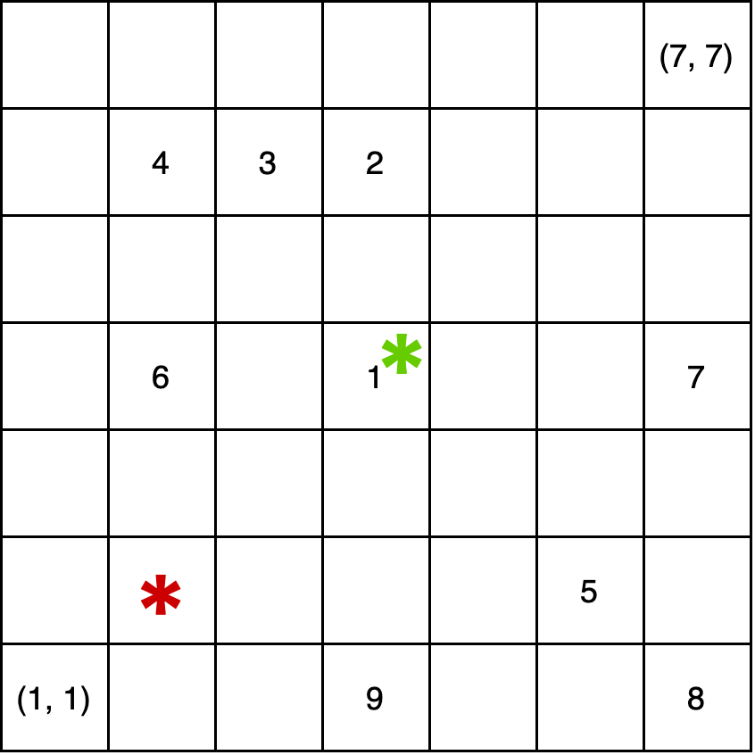
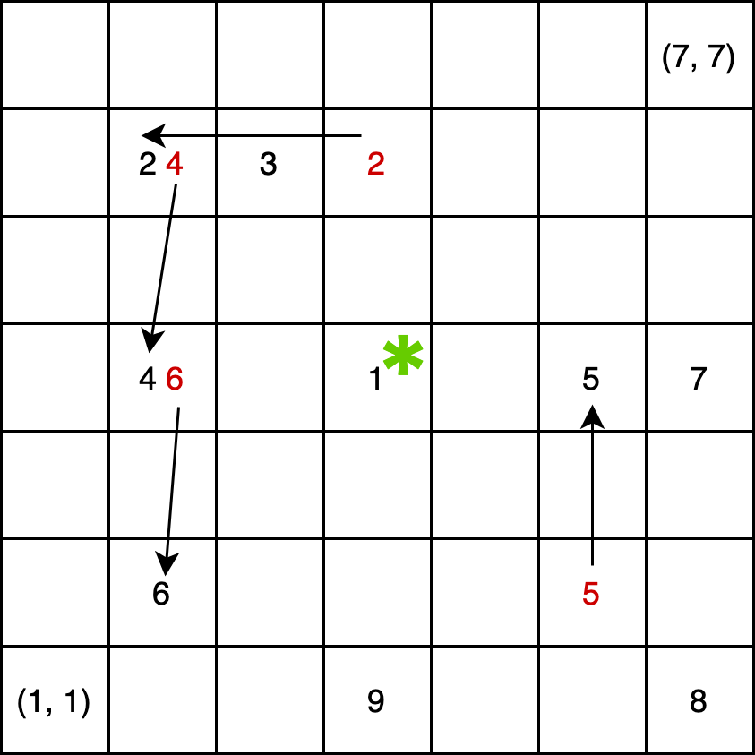

**时间限制：** 2.0 秒 


**空间限制：** 1024 MiB


## 题目描述

西西艾弗岛的下方是一个庞大的遗迹群，神兽“阴阳龙”栖居在这个遗迹群中。

为了得到这件宝物，西西艾弗遗迹探索有限公司（以下简称“公司”）派遣了 $p$ 名员工前往遗迹群，这些员工依次编号为 $1$ 到 $p$。

遗迹可以视为一个大小为 $n\times m$ 的网格，左下角坐标 $(1,1)$，右上角坐标 $(n,m)$。初始时，第 $i$ 名员工所在的位置是 $(x_i,y_i)$。**保证所有员工初始所在的位置两两不同**。

作为神兽，阴阳龙有着特殊之处。当其在 $\mathbf p=(u,v)$ 位置以强度 $t\in[1,7]$ 现身时，会导致遗迹群的环境发生阴和阳的变转，从而导致在遗迹中的人的位置发生变化。

具体来说，阴阳龙首先观察右、右上、上、左上、左、左下、下和右下这八个方向，并在这八个方向找到和阴阳龙“距离”最近的员工（不包括 $\mathbf p$）的“距离”。
其中，垂直和水平方向的“距离”是指员工和阴阳龙连线的长度；斜线方向的“距离”是指员工和阴阳龙连线在水平方向上投影的长度。设想从阴阳龙的位置同时出发，
分别向这 8 个方向前进，每一单位时间运动 1 个“距离”。如果在某一时刻，在某一方向刚好遇到一位员工，则此时前进的距离即被记为 $k$；否则，如果在某一时刻，
在某一方向上刚好到达遗迹的边界，但是在此之前任何方向上都没有遇到员工，则令 $k=0$。形式化描述上述确定 $k$ 的方法是：

记 $\mathbf d_0$ 到 $\mathbf d_7$ 依次为向量 $(1,0),(1,1),(0,1),(-1,1),(-1,0),(-1,-1),(0,-1),(1,-1)$，令：
$$ K_1=\\{k\in\mathbb N^+ \mid \exists i\in[0,7],j\in[1,p],\text{s.t.}(x_j,y_j)=\mathbf p+k\mathbf d_i\\} $$
$$ K_2=\\{k\in\mathbb N^+\mid\forall i\in[0,7],(\mathbf p+k\mathbf d_i)\in[1,n]\times[1,m]\\} $$

其中：

  - $(x_i,y_i)$ 为第 $i$ 名员工在此次阴阳龙现身前的位置（这个位置可能和其初始位置不同，但为了方便起见，我们使用同一个记号）；
  - $K_1$ 为所有员工到阴阳龙距离组成的集合；
  - $K_2$ 为从阴阳龙出发直至在某一方向抵达边界所包括全部的距离组成的集合。

若 $K=K_1\bigcap K_2=\emptyset$，则令 $k=0$；否则令 $k=\min K>0$。

例如，参考下图中的例子，其中左下角为 $(1,1)$，右上角为 $(7,7)$，共有 $8$ 名员工，位置如图。

若 $\mathbf p=(4,4)$，那么员工 1 刚好在阴阳龙所在位置，不计入；员工 3 不在阴阳龙的 8 个方向上，不计入；员工 2、4、5、6 与阴阳龙“距离”是 2；员工 7、8、9 与阴阳龙“距离”是 3，因此有 $K_1 = \\{2, 3\\}$。由于与阴阳龙“距离”为 3 就到达了遗迹的边界，所以有 $K_2 = \\{1, 2, 3\\}$。因此 $k=2$。

若 $\mathbf p=(2,2)$，那么员工 2、3、7、8、9都不在阴阳龙的 8 个方向上，不计入；员工 1、6 与阴阳龙的“距离”是 2；员工 4、5 与阴阳龙的“距离”是 4，因此有 $K_1 = \\{2,4\\}$。由于与阴阳龙“距离”为 1 时，就在向下、向左、向左下三个方向上到达了遗迹的边界，所以有 $K_2 = \\{1\\}$。因此 $k=0$。

    


如果 $k > 0$，则将八个方向上的距离为 $k$ 的位置上的员工以 $\mathbf p$ 为中心逆时针旋转 $t$ 倍的八分之一个圆周的角度。形式化地：

- 若 $k=0$，则什么也不会发生。

- 否则，$\forall i\in[0,7]$，若 $\mathbf p+k\mathbf d_i$ 位置上有员工，那么其该员工会被移动到 $\mathbf p+k\mathbf d_{(i+t)\bmod 8}$。

易知在所有员工移动结束后，每个位置上仍至多有一个员工。例如，在上图所示的例子中取 $\mathbf p=(4,4),t=1$，则变化后各员工所在位置如下图所示。

    

在全部员工进入遗迹群后，西西艾弗遗迹探索有限公司总共探测到 $q$ 次阴阳龙的现身。很不幸的是，由于来自东方神秘力量的干扰，这 $q$ 次阴阳龙的现身后，西西艾弗遗迹探索有限公司失去了所有员工的位置信息，因此他希望你帮他计算出所有员工的位置。

## 输入格式

从标准输入读入数据。

第一行四个正整数 $n,m,p,q$；

接下来 $p$ 行，第 $i$ 行两个正整数 $(x_i,y_i)$ 表示第 $i$ 名员工的初始位置。

**保证所有员工初始所在的位置两两不同**。

接下来 $q$ 行，第 $i$ 行三个正整数 $u_i,v_i,t_i$ 表示西西艾弗遗迹探索有限公司探测到的第 $i$ 次阴阳龙现身的位置和强度。

## 输出格式

输出到标准输出。

为了减少输出量，设 $q$ 次阴阳龙的现身后所有员工的位置为 $(x_1,y_1),\dots,(x_p,y_p)$，则你只需要输出：
$$
\bigoplus_{i=1}^p i\times x_i+y_i
$$
其中 $\bigoplus$ 表示按位异或，即 `C/C++` 中的 `^` 运算符。


## 样例1输入

```plain
3 3 9 1
1 1
1 2
1 3
2 1
2 2
2 3
3 1
3 2
3 3
2 2 1
```


## 样例1输出

```plain
20

```


## 样例1解释

阴阳龙现身前，每个员工所在的位置如下：

```
3 6 9
2 5 8
1 4 7
```

阴阳龙现身一次后，每个员工所在位置如下：

```
6 9 8
3 5 7
2 1 4
```

## 数据范围

 
	


<table class="table table-bordered"><thead><tr><th rowspan="1">子任务编号</th><th rowspan="1">$n\le$</th><th rowspan="1">$m\le$</th><th rowspan="1">$p\le$</th><th rowspan="1">$q\le$</th><th rowspan="1">子任务分值</th></tr></thead><tbody><tr><td rowspan="1">$1$</td><td rowspan="1">$10^{3}$</td><td rowspan="1">$10^{3}$</td><td rowspan="1">$10^{5}$</td><td rowspan="1">$10^{5}$</td><td rowspan="1">$40$</td></tr><tr><td rowspan="1">$2$</td><td rowspan="1">$10^{9}$</td><td rowspan="1">$10^{9}$</td><td rowspan="1">$10^{3}$</td><td rowspan="1">$10^{3}$</td><td rowspan="1">$15$</td></tr><tr><td rowspan="1">$3$</td><td rowspan="1">$10^{5}$</td><td rowspan="1">$10^{5}$</td><td rowspan="2">$10^{5}$</td><td rowspan="2">$10^{5}$</td><td rowspan="1">$25$</td></tr><tr><td rowspan="1">$4$</td><td rowspan="1">$10^{9}$</td><td rowspan="1">$10^{9}$</td><td rowspan="1">$20$</td></tr></tbody></table> 

对于全部数据：

$1\leq n,m\leq 10^9,1\leq p,q\leq 1\times 10^5,1\leq x_i,u\leq n,1\leq y_i,v\leq m, 1 \leq t_i \leq 7$。

**保证所有员工初始所在的位置两两不同**。