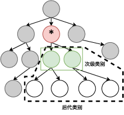
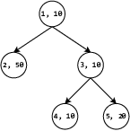
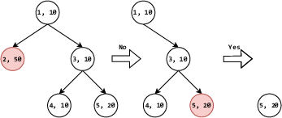
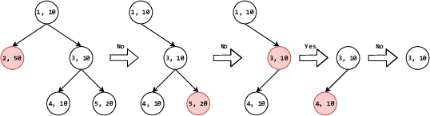

**时间限制：** 1.0 秒 


**空间限制：** 512 MiB

[下载题目目录（样例文件）](examples/CSP202312-3.zip)


## 题目背景

西西艾弗岛大数据中心为了收集用于模型训练的数据，推出了一项自愿数据贡献的系统。岛上的居民可以登录该系统，回答系统提出的问题，从而为大数据中心提供数据。为了保证数据的质量，系统会评估回答的正确性，如果回答正确，系统会给予一定的奖励。

近期，大数据中心需要收集一批关于名词分类的数据。系统中会预先设置若干个名词类别，这些名词类别存在一定的层次关系。例如，“动物”是“生物”的次级类别，“鱼类”是“动物”的次级类别，“鸟类”是“动物”的次级类别，“鱼类”和“鸟类”是“动物”下的邻居类别。这些名词类别可以被按树形组织起来，即除了根类别外，每个类别都有且仅有一个上级类别。
并且所有的名词都可以被归类到某个类别中，即每个名词都有且仅有一个类别与其对应。一个类别的后代类别的定义是：若该类别没有次级类别，则该类别没有后代类别；否则该类别的后代类别为该类别的所有次级类别，以及其所有次级类别的后代类别。

下图示意性地说明了标有星号的类别的次级类别和后代类别。

  

系统向用户提出问题的形式是：某名词是否属于某类别，而用户可以选择“是”或“否”来回答问题。该问题的含义是：某名词是否可以被归类到某类别或其后代类别中。

例如，要确定名词“鳕鱼”的类别，系统会向用户提出“鳕鱼是否属于动物”，当用户选择“是”时，系统会进一步询问“鳕鱼是否属于鱼类”，当用户选择“是”时，即可确定“鳕鱼”可以被归类到“鱼类”这一类别。

此外，如果没有更具体的分类，某一名词也可以被归类到非叶子结点的类别中。例如，要确定“猫”的类别，系统可以向用户提出“猫是否属于动物”，当用户选择“是”时，系统会进一步分别询问“猫”是否属于“鱼类”和“鸟类”，当两个问题收到了否定的答案后，系统会确定“猫”的类别是“动物”。

大数据中心根据此前的经验，已经知道了一个名词属于各个类别的可能性大小。为了用尽量少的问题确定某一名词的类别，大数据中心希望小 C 来设计一个方法，以减少系统向用户提出的问题的数量。

## 题目描述

小 C 观察了事先收集到的数据，并加以统计，得到了一个名词属于各个类别的可能性大小的信息。具体而言，每个类别都可以赋予一个被称为权重的值，值越大，说明一个名词属于该类别的可能性越大。由于每次向用户的询问可以获得两种回答，小 C 联想到了二分策略。他设计的策略如下：

1. 对于每一个类别，统计它和其全部后代类别的权重之和，同时统计其余全部类别的权重之和，并求二者差值的绝对值，计为 $w_{\delta}$；
2. 选择 $w_{\delta}$ 最小的类别，如果有多个，则选取编号最小的那一个，向用户询问名词是否属于该类别；
3. 如果用户回答“是”，则仅保留该类别及其后代类别，否则仅保留其余类别；
4. 重复步骤 1，直到只剩下一个类别，此时即可确定名词的类别。

小 C 请你帮忙编写一个程序，来测试这个策略的有效性。你的程序首先读取到所有的类别及其上级次级关系，以及每个类别的权重。你的程序需要测试对于被归类到给定类别的名词，按照上述策略提问，向用户提出的所有问题。

## 输入格式

从标准输入读入数据。

输入的第一行包含空格分隔的两个正整数 $n$ 和 $m$，分别表示全部类别的数量和需要测试的类别的数量。所有的类别从 $1$ 到 $n$ 编号，其中编号为 1 的是根类别。

输入的第二行包含 $n$ 个空格分隔的正整数 $w_1, w_2, \dots, w_n$，其中第 $i$ 个数 $w_i$ 表示编号为 $i$ 的类别的权重。

输入的第三行包含 $(n-1)$ 个空格分隔的正整数 $p_2, p_3, \dots, p_n$，其中第 $i$ 个数 $p_{i+1}$ 表示编号为 $(i+1)$ 的类别的上级类别的编号，其中 $p_{i} \in [1, n]$

接下来输入 $m$ 行，每行一个正整数，表示需要测试的类别编号。

## 输出格式

输出 $m$ 行，每行表示对一个被测试的类别的测试结果。表示按小 C 的询问策略，对属于给定的被测类别的名词，需要依次向用户提出的问题。

每行包含若干空格分隔的正整数，每个正整数表示一个问题中包含的类别的编号，按照提问的顺序输出。


## 样例1输入

```plain
5 2
10 50 10 10 20
1 1 3 3
5
3

```


## 样例1输出

```plain
2 5
2 5 3 4

```


## 样例1解释

上述输入数据所表示的类别关系如下图所示，同时各个类别的权重也标注在了图上。

  

对于归类于类别 5 的某个名词，按照上述询问策略，应当对于树上的每个节点，都计算 $w_{\delta}$ 的值，对于类别 1 至 5，得到的 $w_{\delta}$ 分别为：100、0、20、80、60。因此首先就类别 2 提问。由于类别 5 不属于类别 2 的后代类别，因此用户回答“否”，此时去除类别 2 和其全部后代类别，仅保留类别 1、3、4、5。对于剩下的类别，计算 $w_{\delta}$ 的值，得到的 $w_{\delta}$ 分别为：50、30、30、10。因此再就类别 5 提问。由于类别 5 就是被提问的名词所属类别，因此用户回答“是”，此时仅保留类别 5 和其全部后代类别。我们发现，这个时候，只剩下类别 5，因此算法结束。上述过程如下图所示：

  

对于归类于类别 3 的某个名词，按照上述询问策略，依次对类别 2、5 提问，过程与前述一致。但是由于类别 3 不属于类别 2 的后代类别，用户回答“否”，此时应当去掉类别 5 和其后代类别，仅保留类别 1、3、4。分别计算 $w_{\delta}$ 得：30、10、10。此时应当选择编号较小的类别 3 提问。由于类别 3 就是被提问的名词所属类别，因此用户回答“是”，此时仅保留类别 3 和其全部后代类别。我们发现，这个时候，并非只剩下一个类别，因此算法还应继续进行。剩下的类别有 3、4，分别计算 $w_{\delta}$ 得：20、0。因此再就类别 4 提问。由于类别 3 不属于类别 4 的后代类别，用户回答“否”，此时应当去掉类别 4 和其后代类别，仅保留类别 3。我们发现，这个时候，只剩下类别 3，因此算法结束。上述过程如下图所示：

  

## 子任务

对 20% 的数据，各个类别的权重相等，且每个类别的上级类别都是根类别；

对另外 20% 的数据，每个类别的权重相等，且每个类别至多有一个下级类别；

对 60% 的数据，有 $n \leq 100$，且 $m \leq 10$；

对 100% 的数据，有 $n \leq 2000$，$m \leq 100$，且 $w_i \leq 10^7$。