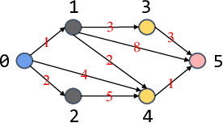

**时间限制：** 2.0 秒 


**空间限制：** 512 MiB

[下载题目目录（样例文件）](examples/CSP202312-5.zip)


## 题目描述

西西艾弗岛的路线图可以看作是一个具有 $N$ 个节点和 $M$ 条有向边的图。
第 $i$ 个节点（$0 \leq i < N$）有一个颜色标签 $C[i] \in \\{0, 1, \cdots, K-1\\}$，第 $j$ 条边（$0 \leq j < M$）从节点 $U[j]$ 指向节点 $V[j]$，长度为 $D[j]$。

对于游客顿顿来说，理想的观光路线应满足以下条件：

* 是一条从节点 $0$ 到节点 $N-1$ 的简单路径；

* 是一条**彩色路径**，即路径上每个节点的颜色标签均不相同；

* 并且包含的节点数小于或等于 $L$。

具体而言，理想的观光路线是一个节点序列，例如 $(t_0, t_1, \cdots, t_{q-1})$，满足以下所有要求：

* 对于每个 $i$（$0 \leq i < q-1$），存在一条从节点 $t_i$ 到节点 $t_{i+1}$ 的有向边。

* $t_0 = 0$ 且 $t_{q-1} = N-1$

* 对于每对 $i, j$（$0 \leq i < j < q$），都有 $C[t_i] \neq C[t_j]$。

* $q \leq L$

一条路径的长度定义为边的总长度。你的任务是找到满足游客顿顿所有要求的**最长**观光路线。

## 输入格式

从标准输入读入数据。

输入共五行。

输入的第一行包含四个正整数 $N$、$M$、$L$ 和 $K$，分别表示图的节点数、边数、理想观光路线的节点数上限和颜色标签范围。

输入的第二行包含 $N$ 个整数 $C[0], C[1], \cdots, C[N-1]$，表示图中每个节点的颜色标签。

接下来输入边的信息。

输入的第三行包含 $M$ 个整数 $U[0], U[1], \cdots, U[M-1]$，表示每条有向边的起点；

输入的第四行包含 $M$ 个整数 $V[0], V[1], \cdots, V[M-1]$，表示每条有向边的终点；

输入的第五行包含 $M$ 个整数 $D[0], D[1], \cdots, D[M-1]$，表示每条有向边的长度。

输入数据保证不存在起点终点相同的边，如 $(u, u)$；每条有向边 $(u, v)$ 仅会出现一次，但不排除 $(u, v)$ 和 $(v, u)$ 可能同时存在。

## 输出格式

输出到标准输出。

输出一个数，表示理想观光路线的最大长度。


## 样例输入

```plain
6 9 4 10
0 2 2 3 3 9
0 0 0 1 1 1 2 3 4
1 2 4 3 4 5 4 5 5
1 2 4 3 2 8 5 3 1
```


## 样例输出

```plain
9

```


以下是示例图，其中黑色和红色数字分别表示节点编号和边的长度。

## 样例解释

  

如下表所示，在不超过四个节点的限制下，共有五条从节点 $0$ 到节点 $5$ 的**彩色路径**。其中最长的一条是 $(0, 1, 5)$，长度为 $9$。

 
	


<table class="table table-bordered"><thead><tr><th rowspan="1">彩色路径</th><th rowspan="1">节点数</th><th rowspan="1">长度</th></tr></thead><tbody><tr><td rowspan="1">$(0, 1, 3, 5)$</td><td rowspan="3">4</td><td rowspan="1">7</td></tr><tr><td rowspan="1">$(0, 1, 4, 5)$</td><td rowspan="1">4</td></tr><tr><td rowspan="1">$(0, 2, 4, 5)$</td><td rowspan="1">8</td></tr><tr><td rowspan="1">$(0, 1, 5)$</td><td rowspan="2">3</td><td rowspan="1">9</td></tr><tr><td rowspan="1">$(0, 4, 5)$</td><td rowspan="1">5</td></tr></tbody></table> 

## 子任务

$20\\%$ 的测试数据满足：对于每个 $i$（$0 \leq i < N-1$），有 $C[i] \leq C[i + 1]$，以及对于每个 $j$（$0 \leq j < M$），有 $U[j] < V[j]$。

另有 $30\\%$ 测试数据满足：$K \leq 15$。

全部的测试数据满足：

* $2 \leq N \leq 100$

* $1 \leq M \leq 5000$

* $2 \leq L \leq 9 \leq K \leq 30$

* $C[0] = 0$ 且 $C[N-1] = K-1$

* 对于每个 $i$（$1 \leq i \leq N-2$）：
$$1 \leq C[i] \leq K-2$$

* 对于每个 $j$（$0 \leq j < M$）：
$$0 \leq U[j], V[j] < N$$
$$C[U[j]] \neq C[V[j]]$$
$$1 \leq D[j] \leq 10^{6}$$

* 至少存在一条从节点 $0$ 到节点 $N-1$ 的彩色路径，节点数不超过 $L$。