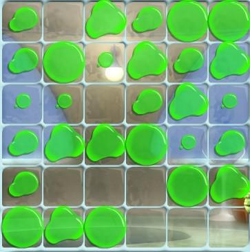

**时间限制：** 3.0 秒 


**空间限制：** 512 MiB

[下载题目目录（样例文件）](examples/CSP202403-4.zip)


## 题目描述

十滴水是一个非常经典的小游戏。

  

小 C 正在玩一个一维版本的十滴水游戏。我们通过一个例子描述游戏的基本规则。

游戏在一个 $1 \times c$ 的网格上进行，格子用整数 $x(1 \leq x \leq c)$ 编号，编号从左往右依次递增。网格内 $m$ 个格子里有 $1 \sim 4$ 滴水，其余格子里没有水。在我们的例子中，$c=m=5$，按照编号顺序，每个格子中分别有 $2,4,4,4,2$ 滴水。

玩家可以进行若干次操作，每次操作中，玩家选择一个有水的格子，将格子的水滴数加一。任何时刻若某个格子的水滴数大于等于 $5$，这个格子里的水滴就会向两侧**爆开**。此时，这个格子的水被清空，同时对于左方、右方两个方向**同时**进行以下操作：找到当前格子在对应方向上最近的有水的格子，如果存在这样的格子，将这个格子的水滴数加一。**若在某个时刻，有多个格子的水滴数大于等于 $5$，则最靠左的先爆开。**

在我们的例子中，若玩家对第三格进行操作，则其水滴数变为 $5$，故第三格水滴爆开，水被清空，其左侧最近的有水格子（第二格）和右侧最近的有水格子（第四格）的水量增加 $1$，此时每个格子中分别有 $2,5,0,5,2$ 滴水。

此时第二格和第四格的水滴数均大于等于 $5$，按照规则，第二格的水先爆开，爆开后每个格子中分别有 $3,0,0,6,2$ 滴水；最后第四格的水滴爆开，每个格子中分别有 $4,0,0,0,3$ 滴水。

小 C 开始了一局游戏并进行了 $n$ 次操作。小 C 在每次操作后，会等到所有水滴数大于等于 $5$ 的格子里的水滴都爆开再进行下一次操作。

小 C 想知道他的水平有多高，于是他想知道每一次操作后还有多少格子里有水。

保证这 $n$ 次操作都是合法的，即每次操作时操作的格子里都有水。

## 输入格式

从标准输入读入数据。

输入的第一行三个整数 $c,m,n$ 分别表示网格宽度、有水的格子个数以及操作次数。

接下来 $m$ 行每行两个整数 $x, w$，表示第 $x$ 格有 $w$ 滴水。

接下来 $n$ 行每行一个整数 $p$，表示小 C 对第 $p$ 格做了一次操作。

## 输出格式

输出到标准输出。

输出 $n$ 行，每行一个整数表示这次操作之后网格上有水的格子数量。


## 样例1输入

```plain
5 5 2
1 2
2 4
3 4
4 4
5 2
3
1

```


## 样例1输出

```plain
2
1

```


## 子任务

对于所有测试数据，

- $1 \leq c \leq 10^9$，$1 \leq m \leq \min(c, 3 \times 10^5)$，$1 \leq n \leq 4m$；
- $1 \leq x, p \leq c$，$1 \leq w \leq 4$；
- 输入的所有 $x$ 两两不同；
- 对于每个输入的 $p$，保证在对应操作时 $p$ 内有水。

 
	


<table class="table table-bordered"><thead><tr><th rowspan="1">子任务编号</th><th rowspan="1">$c \le$</th><th rowspan="1">$m \le$</th><th rowspan="1">特殊性质</th><th rowspan="1">分值</th></tr></thead><tbody><tr><td rowspan="1">1</td><td rowspan="1">$30$</td><td rowspan="1">$30$</td><td rowspan="2">有</td><td rowspan="2">15</td></tr><tr><td rowspan="1">2</td><td rowspan="2">$3,000$</td><td rowspan="3">$3,000$</td></tr><tr><td rowspan="1">3</td><td rowspan="3">无</td><td rowspan="1">10</td></tr><tr><td rowspan="1">4</td><td rowspan="1">$10^{9}$</td><td rowspan="4">15</td></tr><tr><td rowspan="1">5</td><td rowspan="1">$3 \times 10^{5}$</td><td rowspan="3">$3 \times 10^{5}$</td></tr><tr><td rowspan="1">6</td><td rowspan="2">$10^{9}$</td><td rowspan="1">有</td></tr><tr><td rowspan="1">7</td><td rowspan="1">无</td></tr></tbody></table> 

特殊性质：在游戏的任意时刻（包括水滴爆开的连锁反应过程中），只有至多一个格子的水滴数大于等于 $5$。