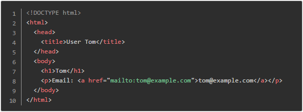
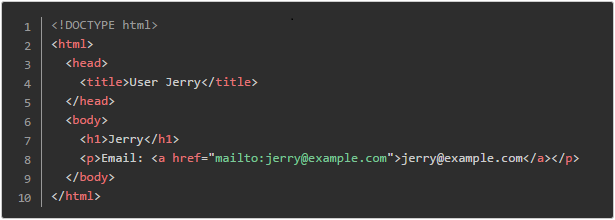

## 问题描述
<p class="NOI0"><span style="font-family:宋体;mso-ascii-font-family:&quot;Times New Roman&quot;;
mso-hansi-font-family:&quot;Times New Roman&quot;">成成最近在搭建一个网站，其中一些页面的部分内容来自数据库中不同的数据记录，但是页面的基本结构是相同的。例如，对于展示用户信息的页面，当用户为</span><span lang="EN-US"> Tom </span><span style="font-family:宋体;mso-ascii-font-family:&quot;Times New Roman&quot;;
mso-hansi-font-family:&quot;Times New Roman&quot;">时，网页的源代码是</span></p>
<p class="NOI0"><span style="font-family:宋体;mso-ascii-font-family:&quot;Times New Roman&quot;;
mso-hansi-font-family:&quot;Times New Roman&quot;"></span><span lang="EN-US"><o:p></o:p></span></p>
<p class="NOI0" style="text-indent:0cm;mso-char-indent-count:0"><span lang="EN-US"><v:shapetype id="_x0000_t75" coordsize="21600,21600" o:spt="75" o:preferrelative="t" path="m@4@5l@4@11@9@11@9@5xe" filled="f" stroked="f">  <v:stroke joinstyle="miter">  <v:formulas>   <v:f eqn="if lineDrawn pixelLineWidth 0">   <v:f eqn="sum @0 1 0">   <v:f eqn="sum 0 0 @1">   <v:f eqn="prod @2 1 2">   <v:f eqn="prod @3 21600 pixelWidth">   <v:f eqn="prod @3 21600 pixelHeight">   <v:f eqn="sum @0 0 1">   <v:f eqn="prod @6 1 2">   <v:f eqn="prod @7 21600 pixelWidth">   <v:f eqn="sum @8 21600 0">   <v:f eqn="prod @7 21600 pixelHeight">   <v:f eqn="sum @10 21600 0">  </v:f></v:f></v:f></v:f></v:f></v:f></v:f></v:f></v:f></v:f></v:f></v:f></v:formulas>  <v:path o:extrusionok="f" gradientshapeok="t" o:connecttype="rect">  <o:lock v:ext="edit" aspectratio="t"> </o:lock></v:path></v:stroke></v:shapetype><v:shape id="图片_x0020_1" o:spid="_x0000_i1026" type="#_x0000_t75" style="width:414.75pt;height:106.5pt;visibility:visible;mso-wrap-style:square">  <v:imagedata src="file:///C:\Users\Weidong\AppData\Local\Temp\msohtmlclip1\01\clip_image001.png" o:title="p1"> </v:imagedata></v:shape></span><span lang="EN-US"><o:p></o:p></span></p>
<p class="NOI0"><span style="font-family:宋体;mso-ascii-font-family:&quot;Times New Roman&quot;;
mso-hansi-font-family:&quot;Times New Roman&quot;">而当用户为</span><span lang="EN-US"> Jerry </span><span style="font-family:宋体;mso-ascii-font-family:&quot;Times New Roman&quot;;mso-hansi-font-family:
&quot;Times New Roman&quot;">时，网页的源代码是</span></p>
<p class="NOI0"><span style="font-family:宋体;mso-ascii-font-family:&quot;Times New Roman&quot;;mso-hansi-font-family:
&quot;Times New Roman&quot;"></span><span lang="EN-US"><o:p></o:p></span></p>
<p class="NOI0" style="text-indent:0cm;mso-char-indent-count:0"><span lang="EN-US"><v:shape id="图片_x0020_14" o:spid="_x0000_i1025" type="#_x0000_t75" style="width:414.75pt;height:106.5pt;visibility:visible;
mso-wrap-style:square">  <v:imagedata src="file:///C:\Users\Weidong\AppData\Local\Temp\msohtmlclip1\01\clip_image002.png" o:title="p2"> </v:imagedata></v:shape></span><span lang="EN-US"><o:p></o:p></span></p>
<p class="NOI0"><span style="font-family:宋体;mso-ascii-font-family:&quot;Times New Roman&quot;;
mso-hansi-font-family:&quot;Times New Roman&quot;">这样的例子在包含动态内容的网站中还有很多。为了简化生成网页的工作，成成觉得他需要引入一套模板生成系统。</span><span lang="EN-US"><o:p></o:p></span></p>
<p class="NOI0"><span style="font-family:宋体;mso-ascii-font-family:&quot;Times New Roman&quot;;
mso-hansi-font-family:&quot;Times New Roman&quot;">模板是包含特殊标记的文本。成成用到的模板只包含一种特殊标记，格式为</span><span lang="EN-US"> {{ VAR }}</span><span style="font-family:宋体;mso-ascii-font-family:
&quot;Times New Roman&quot;;mso-hansi-font-family:&quot;Times New Roman&quot;">，其中</span><span lang="EN-US"> VAR </span><span style="font-family:宋体;mso-ascii-font-family:&quot;Times New Roman&quot;;
mso-hansi-font-family:&quot;Times New Roman&quot;">是一个变量。该标记在模板生成时会被变量</span><span lang="EN-US"> VAR </span><span style="font-family:宋体;mso-ascii-font-family:&quot;Times New Roman&quot;;
mso-hansi-font-family:&quot;Times New Roman&quot;">的值所替代。例如，如果变量</span><span lang="EN-US"> name = &quot;Tom&quot;</span><span style="font-family:宋体;mso-ascii-font-family:
&quot;Times New Roman&quot;;mso-hansi-font-family:&quot;Times New Roman&quot;">，则</span><span lang="EN-US"> {{ name }} </span><span style="font-family:宋体;mso-ascii-font-family:
&quot;Times New Roman&quot;;mso-hansi-font-family:&quot;Times New Roman&quot;">会生成</span><span lang="EN-US"> Tom</span><span style="font-family:宋体;mso-ascii-font-family:&quot;Times New Roman&quot;;
mso-hansi-font-family:&quot;Times New Roman&quot;">。具体的规则如下：</span><span lang="EN-US"><o:p></o:p></span></p>
<p class="NOI0"><span style="font-family:宋体;mso-ascii-font-family:&quot;Times New Roman&quot;;
mso-hansi-font-family:&quot;Times New Roman&quot;">&middot;变量名由大小写字母、数字和下划线</span><span lang="EN-US"> (_) </span><span style="font-family:宋体;mso-ascii-font-family:&quot;Times New Roman&quot;;
mso-hansi-font-family:&quot;Times New Roman&quot;">构成，且第一个字符不是数字，长度不超过</span><span lang="EN-US"> 16 </span><span style="font-family:宋体;mso-ascii-font-family:&quot;Times New Roman&quot;;
mso-hansi-font-family:&quot;Times New Roman&quot;">个字符。</span><span lang="EN-US"><o:p></o:p></span></p>
<p class="NOI0"><span style="font-family:宋体;mso-ascii-font-family:&quot;Times New Roman&quot;;
mso-hansi-font-family:&quot;Times New Roman&quot;">&middot;变量名是大小写敏感的，</span><span lang="EN-US">Name </span><span style="font-family:宋体;mso-ascii-font-family:&quot;Times New Roman&quot;;
mso-hansi-font-family:&quot;Times New Roman&quot;">和</span><span lang="EN-US"> name </span><span style="font-family:宋体;mso-ascii-font-family:&quot;Times New Roman&quot;;mso-hansi-font-family:
&quot;Times New Roman&quot;">是两个不同的变量。</span><span lang="EN-US"><o:p></o:p></span></p>
<p class="NOI0"><span style="font-family:宋体;mso-ascii-font-family:&quot;Times New Roman&quot;;
mso-hansi-font-family:&quot;Times New Roman&quot;">&middot;变量的值是字符串。</span><span lang="EN-US"><o:p></o:p></span></p>
<p class="NOI0"><span style="font-family:宋体;mso-ascii-font-family:&quot;Times New Roman&quot;;
mso-hansi-font-family:&quot;Times New Roman&quot;">&middot;如果标记中的变量没有定义，则生成空串，相当于把标记从模板中删除。</span><span lang="EN-US"><o:p></o:p></span></p>
<p class="NOI0"><span style="font-family:宋体;mso-ascii-font-family:&quot;Times New Roman&quot;;
mso-hansi-font-family:&quot;Times New Roman&quot;">&middot;模板不递归生成。也就是说，如果变量的值中包含形如</span><span lang="EN-US"> {{ VAR }} </span><span style="font-family:宋体;mso-ascii-font-family:
&quot;Times New Roman&quot;;mso-hansi-font-family:&quot;Times New Roman&quot;">的内容，不再做进一步的替换。</span><span lang="EN-US"><o:p></o:p></span></p>

## 输入格式

<p class="NOI0"><span style="font-family:宋体;mso-ascii-font-family:&quot;Times New Roman&quot;;
mso-hansi-font-family:&quot;Times New Roman&quot;">输入的第一行包含两个整数</span> <i><span lang="EN-US">m</span></i><span lang="EN-US">, <i>n</i></span><span style="font-family:宋体;mso-ascii-font-family:&quot;Times New Roman&quot;;mso-hansi-font-family:
&quot;Times New Roman&quot;">，分别表示模板的行数和模板生成时给出的变量个数。</span><span lang="EN-US"><o:p></o:p></span></p>
<p class="NOI0"><span style="font-family:宋体;mso-ascii-font-family:&quot;Times New Roman&quot;;
mso-hansi-font-family:&quot;Times New Roman&quot;">接下来</span> <i><span lang="EN-US">m</span></i><span lang="EN-US"> </span><span style="font-family:宋体;mso-ascii-font-family:&quot;Times New Roman&quot;;mso-hansi-font-family:
&quot;Times New Roman&quot;">行，每行是一个字符串，表示模板。</span><span lang="EN-US"><o:p></o:p></span></p>
<p class="NOI0"><span style="font-family:宋体;mso-ascii-font-family:&quot;Times New Roman&quot;;
mso-hansi-font-family:&quot;Times New Roman&quot;">接下来</span> <i><span lang="EN-US">n</span></i><span lang="EN-US"> </span><span style="font-family:宋体;mso-ascii-font-family:&quot;Times New Roman&quot;;mso-hansi-font-family:
&quot;Times New Roman&quot;">行，每行表示一个变量和它的值，中间用一个空格分隔。值是字符串，用双引号</span><span lang="EN-US"> (&quot;) </span><span style="font-family:宋体;mso-ascii-font-family:&quot;Times New Roman&quot;;
mso-hansi-font-family:&quot;Times New Roman&quot;">括起来，内容可包含除双引号以外的任意可打印</span><span lang="EN-US"> ASCII </span><span style="font-family:宋体;mso-ascii-font-family:
&quot;Times New Roman&quot;;mso-hansi-font-family:&quot;Times New Roman&quot;">字符（</span><span lang="EN-US">ASCII </span><span style="font-family:宋体;mso-ascii-font-family:&quot;Times New Roman&quot;;
mso-hansi-font-family:&quot;Times New Roman&quot;">码范围</span><span lang="EN-US"> 32, 33, 35-126</span><span style="font-family:宋体;mso-ascii-font-family:&quot;Times New Roman&quot;;
mso-hansi-font-family:&quot;Times New Roman&quot;">）。</span><span lang="EN-US"><o:p></o:p></span></p>

## 输出格式
<p class="NOI0"><span style="font-family:宋体;mso-ascii-font-family:&quot;Times New Roman&quot;;
mso-hansi-font-family:&quot;Times New Roman&quot;">输出包含若干行，表示模板生成的结果。</span><span lang="EN-US"><o:p></o:p></span></p>

## 样例输入
```
11 2
<!DOCTYPE html>
<html>
  <head>
    <title>User {{ name }}</title>
  </head>
  <body>
    <h1>{{ name }}</h1>
    <p>Email: <a href= "mailto:{{ email }} ">{{ email }}</a></p>
    <p>Address: {{ address }}</p>
  </body>
</html>
name  "David Beckham "
email  "david@beckham.com "
```


## 样例输出
```
<!DOCTYPE html>
<html>
  <head>
    <title>User David Beckham</title>
  </head>
  <body>
    <h1>David Beckham</h1>
    <p>Email: <a href= "mailto:david@beckham.com ">david@beckham.com</a></p>
    <p>Address: </p>
  </body>
</html>
```
## 评测用例规模与约定

0 &le; m &le; 100

0 &le; n &le; 100

输入的模板每行长度不超过 80 个字符（不包含换行符）。

输入保证模板中所有以 {{ 开始的子串都是合法的标记，开始是两个左大括号和一个空格，然后是变量名，结尾是一个空格和两个右大括号。

输入中所有变量的值字符串长度不超过 100 个字符（不包括双引号）。

保证输入的所有变量的名字各不相同。 