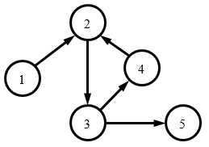

## 问题描述


某国有n个城市，为了使得城市间的交通更便利，该国国王打算在城市之间修一些高速公路，由于经费限制，国王打算第一阶段先在部分城市之间修一些单向的高速公路。

现在，大臣们帮国王拟了一个修高速公路的计划。看了计划后，国王发现，有些城市之间可以通过高速公路直接（不经过其他城市）或间接（经过一个或多个其他城市）到达，而有的却不能。如果城市A可以通过高速公路到达城市B，而且城市B也可以通过高速公路到达城市A，则这两个城市被称为便利城市对。

国王想知道，在大臣们给他的计划中，有多少个便利城市对。


## 输入格式


输入的第一行包含两个整数n, m，分别表示城市和单向高速公路的数量。

接下来m行，每行两个整数a, b，表示城市a有一条单向的高速公路连向城市b。


## 输出格式


输出一行，包含一个整数，表示便利城市对的数量。


## 样例输入
```
5 5
1 2
2 3
3 4
4 2
3 5
```
## 样例输出
```
3
```
## 样例说明



城市间的连接如图所示。有3个便利城市对，它们分别是(2, 3), (2, 4), (3, 4)，请注意(2, 3)和(3, 2)看成同一个便利城市对。

## 评测用例规模与约定

前30%的评测用例满足1 &le; n &le; 100, 1 &le; m &le; 1000；

前60%的评测用例满足1 &le; n &le; 1000, 1 &le; m &le; 10000；

所有评测用例满足1 &le; n &le; 10000, 1 &le; m &le; 100000。