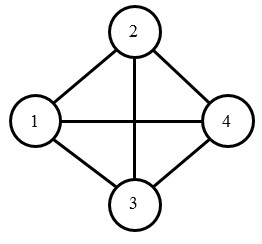

## 问题描述


为了增加公司收入，F公司新开设了物流业务。由于F公司在业界的良好口碑，物流业务一开通即受到了消费者的欢迎，物流业务马上遍及了城市的每条街道。然而，F公司现在只安排了小明一个人负责所有街道的服务。

任务虽然繁重，但是小明有足够的信心，他拿到了城市的地图，准备研究最好的方案。城市中有n个交叉路口，m条街道连接在这些交叉路口之间，每条街道的首尾都正好连接着一个交叉路口。除开街道的首尾端点，街道不会在其他位置与其他街道相交。每个交叉路口都至少连接着一条街道，有的交叉路口可能只连接着一条或两条街道。

小明希望设计一个方案，从编号为1的交叉路口出发，每次必须沿街道去往街道另一端的路口，再从新的路口出发去往下一个路口，直到所有的街道都经过了正好一次。


## 输入格式


输入的第一行包含两个整数n, m，表示交叉路口的数量和街道的数量，交叉路口从1到n标号。

接下来m行，每行两个整数a, b，表示和标号为a的交叉路口和标号为b的交叉路口之间有一条街道，街道是双向的，小明可以从任意一端走向另一端。两个路口之间最多有一条街道。


## 输出格式


如果小明可以经过每条街道正好一次，则输出一行包含m+1个整数p1, p2, p3, ..., pm+1，表示小明经过的路口的顺序，相邻两个整数之间用一个空格分隔。如果有多种方案满足条件，则输出字典序最小的一种方案，即首先保证p1最小，p1最小的前提下再保证p2最小，依此类推。

如果不存在方案使得小明经过每条街道正好一次，则输出一个整数-1。


## 样例输入
```
4 5
1 2
1 3
1 4
2 4
3 4
```
## 样例输出
```
1 2 4 1 3 4
```
## 样例说明

城市的地图和小明的路径如下图所示。

&nbsp;

## 样例输入
```
4 6
1 2
1 3
1 4
2 4
3 4
2 3
```
## 样例输出
```
-1
```
## 样例说明

城市的地图如下图所示，不存在满足条件的路径。


## 评测用例规模与约定

前30%的评测用例满足：1 &le; n &le; 10, n-1 &le; m &le; 20。

前50%的评测用例满足：1 &le; n &le; 100, n-1 &le; m &le; 10000。

所有评测用例满足：1 &le; n &le; 10000，n-1 &le; m &le; 100000。